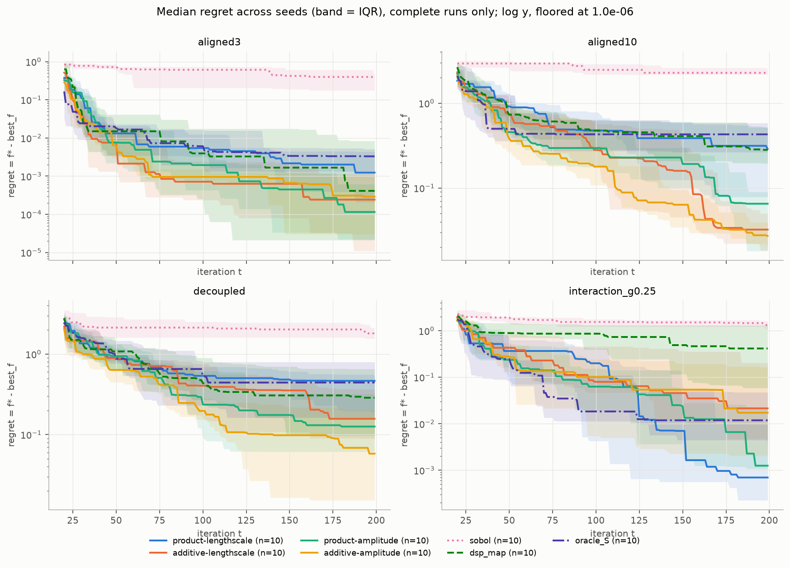
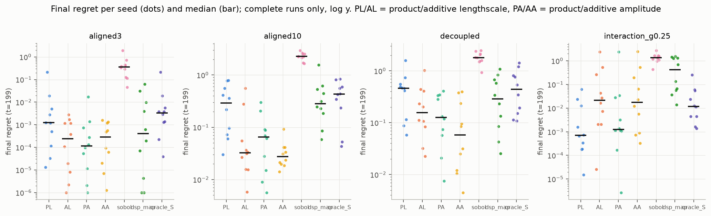
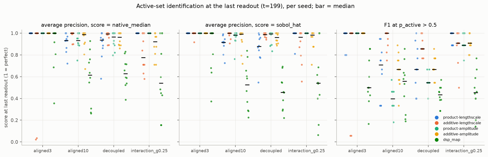
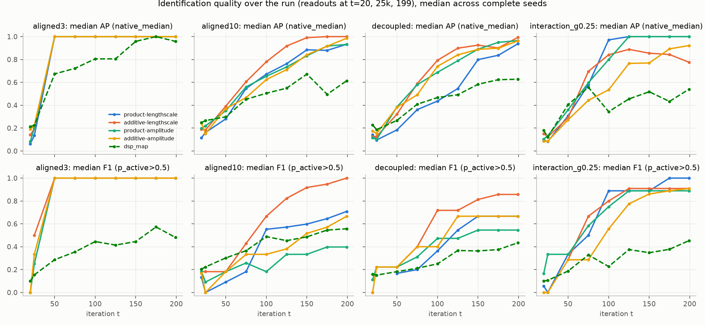
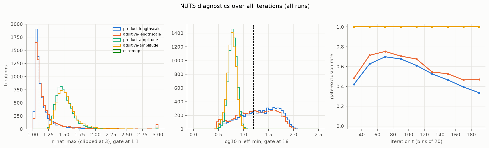
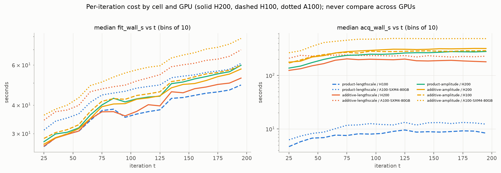

# sagp study analysis

As of **2026-09-12 14:47 EEST** (data: `/scratch/work/tranq8/saasbo/runs`; analysis dir `/scratch/work/tranq8/sagp_analysis/2026-09-12-1428`; script `analyze.py`).

Runs: **280/280 complete** (180 rows). Incomplete: none.

Headline numbers use complete runs only. Seeds are paired: one (family, seed) is one objective and one shared initial design across all 7 methods.

## The five things to know

1. **The study is complete and clean.** 280/280 runs have exactly 180 rows, and all 14 sanity checks pass on every run: regret non-increasing, best_f non-decreasing and equal to f_star - regret, no duplicate or missing t after the resumes (7 OOM resumes at t=89, 5 time-limit resumes at t=188-197), f_star and the true S identical across the 7 methods of each (family, seed), and y_mean/y_std at t=20 bit-identical across methods, which proves the shared initial design. The only fallback rows are dsp_map's 27 NotPSDError exceptions (aligned3 7, aligned10 6, interaction 14, decoupled 0).

2. **Optimization: the cell whose structure matches the objective wins, and every cell beats Sobol in 10/10 seeds of every family (p = 0.002).** On the additive families the additive cells lead: aligned10 final-regret medians additive-amplitude 0.027, additive-lengthscale 0.032, product-amplitude 0.065 against dsp_map 0.28, product-lengthscale 0.29, oracle_S 0.43; decoupled additive-amplitude 0.058, product-amplitude 0.13, additive-lengthscale 0.16 against dsp_map 0.29, oracle_S 0.44, product-lengthscale 0.47. Additive-amplitude beats dsp_map and oracle_S in 10/10 seeds on aligned10 and oracle_S in 10/10 on decoupled. On interaction_g0.25 the product cells lead (product-lengthscale 0.0007, product-amplitude 0.0013, against 0.017-0.021 for the additive cells and 0.42 for dsp_map; product-lengthscale beats dsp_map 10/10). On aligned3 every model-based method reaches regret below 0.004 and no cell is distinguishable from dsp_map (p >= 0.08). Product-lengthscale is the weakest cell on the additive families: it loses to additive-amplitude in 10/10 seeds on both aligned10 and decoupled.

3. **Identification: all four cells rank the active coordinates well, and the best identifier is family-dependent.** Pooled over families, average precision by native_median is product-amplitude 0.97, product-lengthscale 0.95, additive-amplitude 0.94, additive-lengthscale 0.89 (dsp_map 0.68). Per family: additive-lengthscale is best on aligned10 and decoupled (AP 0.98 and 0.97, F1 0.94 and 0.88), product-lengthscale on interaction_g0.25 and aligned3 (AP 1.00 in every seed, tied with product-amplitude). The thresholded rule p_active > 0.5 is precise in every cell (precision 0.92-1.00) but the amplitude cells are conservative: recall 0.25-0.54 on aligned10 and decoupled (product-amplitude F1 0.39 on aligned10), where the equal 10% shares of aligned10 and the four 4%-share coordinates of decoupled fall under the share threshold in most draws. sobol_hat ranks about as well as native_median (AP 0.94-0.98 per cell) and is the more robust score (see point 5).

4. **The amplitude cells' 100% gate exclusion is genuine non-convergence, not a marginal miss, and it comes with a sampler that is capped in every cell.** Amplitude cells: r_hat_max median 1.50 (10th percentile 1.36) and n_eff_min median 6 (90th percentile 7.7) against a gate of 1.1 and 16; the failing sites are a_sq and kernel_ell (median r_hat 1.40-1.45 each), the global sites are fine (1.04-1.05). Lengthscale cells fail marginally (r_hat_max median 1.10-1.11, n_eff_min 19-23; exclusion 53% and 59%, peaking at 70-75% around t = 60-80). Every cell saturates max_tree_depth = 6: num_steps_mean >= 62 of 63 in 95-100% of fits, so each NUTS iteration is a truncated trajectory. What this means for the readouts: an amplitude-cell readout is a posterior median over 16 retained draws from a chain with about 6 effective draws on its worst site. The ranking still comes out right (AP 0.94-0.97) because active and inactive a_sq differ by orders of magnitude, but p_active is not a calibrated probability and the between-seed spread of the amplitude readouts is partly sampler noise. In the lengthscale cells, where both kinds exist, gate-excluded readouts do identify worse than passing ones (mean AP 0.79-0.83 against 0.90-0.94). Raising max_tree_depth (or reparameterizing the amplitude funnel) is the first thing to try before trusting amplitude readouts further.

5. **Two things that look wrong.** (a) Additive-lengthscale on aligned3 seeds 02 and 08 ended in a degenerate mode that declares all 100 coordinates active: rho on the inactive coordinates is 100-900 (lengthscales 0.03-0.1) while the three true coordinates have the smallest rho of all (16-27), so the native score is inverted (AP 0.02 and 0.04) although sobol_hat still ranks the true set first (AP 1.00 and 0.92) and regret was unaffected (0.0012 and 0.00002). This is consistent with the unnormalized additive-lengthscale kernel letting ell -> 0 components absorb the noise; the gate did not catch it (seed08's fit passed). It drags additive-lengthscale's aligned3 precision to 0.81 and its pooled AP to 0.89. (b) oracle_S is beaten by the additive cells on the additive families (aligned10 median 0.43 against 0.03; 9-10 of 10 seeds). The oracle knows S but fits one ARD Matern-5/2 MAP GP on those coordinates, so it cannot exploit additivity and is a weak reference there; on interaction_g0.25 it is competitive with the additive cells and only the product cells beat it. Cost, for planning: fit plus acquisition totalled about 1,940 GPU-hours (a lower bound: readouts, checkpoints and queue time excluded); the acquisition dominates the three centered cells (180-470 s per iteration against 40-58 s of fit), and additive-amplitude is the most expensive at a median 17.6 h per run (max 26.6 h, over the 24 h limit).

## What changed since the previous analysis

No previous analysis directory found: this is the first run, nothing to diff against.

## 1. Inventory

| method | runs | complete | rows |
|---|---|---|---|
| product-lengthscale | 40 | 40 | 7200 |
| additive-lengthscale | 40 | 40 | 7200 |
| product-amplitude | 40 | 40 | 7200 |
| additive-amplitude | 40 | 40 | 7200 |
| sobol | 40 | 40 | 7200 |
| dsp_map | 40 | 40 | 7200 |
| oracle_S | 40 | 40 | 7200 |

Objectives: D = 100, noise_sd = 0.1; |S| per family {'aligned3': [3], 'aligned10': [10], 'decoupled': [8], 'interaction_g0.25': [5]}; gamma per family {'aligned3': [0.0], 'aligned10': [0.0], 'decoupled': [0.0], 'interaction_g0.25': [0.25000000000000006]}. Distinct config_hash values: 280 (one per run; the hash covers the objective and the method). Git commits: ['a51a4b9'].

Devices at creation (runs): {'cpu': 120, 'NVIDIA H200': 80, 'NVIDIA A100-SXM4-80GB': 51, 'NVIDIA H100 80GB HBM3': 29}. Runs whose iterations span more than one GPU type (resumed onto a different partition): 8. Resumes per run: {1: 120, 2: 33, 3: 7, 4: 40, 6: 80} (most `resumed` entries are no-op resumes at t=200 recorded by the chain's later Slurm links).

## 2. Sanity checks

| check | n_runs | n_pass | n_fail | failing_runs |
|---|---|---|---|---|
| rows_180 | 280 | 280 | 0 |  |
| no_dup_t | 280 | 280 | 0 |  |
| t_contiguous | 280 | 280 | 0 |  |
| regret_nonincreasing | 280 | 280 | 0 |  |
| best_f_nondecreasing | 280 | 280 | 0 |  |
| best_f_ge_cummax_f | 280 | 280 | 0 |  |
| regret_eq_fstar_minus_bestf | 280 | 280 | 0 |  |
| regret_nonnegative | 280 | 280 | 0 |  |
| log_resumes_eq_manifest | 280 | 280 | 0 |  |
| log_t_set_eq_csv | 280 | 280 | 0 |  |
| f_star_identical | 40 | 40 | 0 |  |
| S_identical | 40 | 40 | 0 |  |
| y_mean_t20_identical | 40 | 40 | 0 |  |
| y_std_t20_identical | 40 | 40 | 0 |  |

`best_f_ge_cummax_f` is a lower-bound check because best_f also covers the 20-point initial design, which is not a row. `regret_eq_fstar_minus_bestf` checks the CSV's regret against manifest.objective.f_star to 1e-9. `log_resumes_eq_manifest` and `log_t_set_eq_csv` verify that log.txt's resume lines match manifest.resumed and that every iteration in the CSV appears once in the log (device attribution relies on this).

## 3. Optimization performance

Final regret at t=199, median [Q1, Q3] across complete seeds, ranked within family (1 = best):

| family | method | n | median_iqr | rank_in_family | mean_rank_within_seed |
|---|---|---|---|---|---|
| aligned10 | additive-amplitude | 10 | 0.0273 [0.0201, 0.0391] | 1 | 1.9 |
| aligned10 | additive-lengthscale | 10 | 0.0323 [0.0184, 0.0502] | 2 | 2.2 |
| aligned10 | product-amplitude | 10 | 0.0653 [0.0181, 0.0897] | 3 | 2.7 |
| aligned10 | dsp_map | 10 | 0.282 [0.195, 0.509] | 4 | 4.8 |
| aligned10 | product-lengthscale | 10 | 0.289 [0.0783, 0.52] | 5 | 4.4 |
| aligned10 | oracle_S | 10 | 0.429 [0.264, 0.583] | 6 | 5 |
| aligned10 | sobol | 10 | 2.28 [2.16, 2.53] | 7 | 7 |
| aligned3 | product-amplitude | 10 | 0.000115 [2.22e-05, 0.000616] | 1 | 2.5 |
| aligned3 | additive-lengthscale | 10 | 0.000242 [1.09e-05, 0.00116] | 2 | 2.9 |
| aligned3 | additive-amplitude | 10 | 0.000291 [3.03e-05, 0.00103] | 3 | 3 |
| aligned3 | dsp_map | 10 | 0.000411 [2.11e-05, 0.0084] | 4 | 3.9 |
| aligned3 | product-lengthscale | 10 | 0.00124 [0.00021, 0.0044] | 5 | 3.7 |
| aligned3 | oracle_S | 10 | 0.0033 [0.00133, 0.00515] | 6 | 5 |
| aligned3 | sobol | 10 | 0.359 [0.167, 0.43] | 7 | 7 |
| decoupled | additive-amplitude | 10 | 0.0581 [0.0153, 0.2] | 1 | 1.8 |
| decoupled | product-amplitude | 10 | 0.126 [0.0615, 0.321] | 2 | 2.4 |
| decoupled | additive-lengthscale | 10 | 0.157 [0.0892, 0.367] | 3 | 3 |
| decoupled | dsp_map | 10 | 0.287 [0.097, 0.653] | 4 | 3.7 |
| decoupled | oracle_S | 10 | 0.443 [0.163, 0.798] | 5 | 5.2 |
| decoupled | product-lengthscale | 10 | 0.465 [0.191, 0.537] | 6 | 4.9 |
| decoupled | sobol | 10 | 1.81 [1.56, 2.11] | 7 | 7 |
| interaction_g0.25 | product-lengthscale | 10 | 0.000699 [0.000227, 0.00994] | 1 | 2 |
| interaction_g0.25 | product-amplitude | 10 | 0.00125 [0.00108, 0.0214] | 2 | 2.4 |
| interaction_g0.25 | oracle_S | 10 | 0.0119 [0.00445, 0.0475] | 3 | 3.3 |
| interaction_g0.25 | additive-amplitude | 10 | 0.0173 [0.00207, 0.164] | 4 | 4 |
| interaction_g0.25 | additive-lengthscale | 10 | 0.0214 [0.00336, 0.205] | 5 | 3.7 |
| interaction_g0.25 | dsp_map | 10 | 0.415 [0.0589, 1.31] | 6 | 5.8 |
| interaction_g0.25 | sobol | 10 | 1.33 [1.09, 1.62] | 7 | 6.8 |

## 4. Paired comparisons (Wilcoxon signed-rank over seeds, final regret at t=199)

`median_diff` = median over seeds of (cell regret - reference regret); negative means the cell is better. Two-sided p-values from scipy.stats.wilcoxon (exact for n=10 without ties). **10 seeds is small**: the smallest attainable two-sided p is 0.002, and a single wild seed moves the median. Raw p-values are NOT corrected for multiple comparisons; `p_holm_within_family_kind` is a Holm correction over the 12 cell-vs-reference tests (or 6 cell-vs-cell tests) inside each family, shown for reference only.

| family | cell | reference | n_seeds | median_diff | n_cell_better | n_ref_better | p_value | p_holm_within_family_kind |
|---|---|---|---|---|---|---|---|---|
| aligned3 | product-lengthscale | sobol | 10 | -0.358 | 10 | 0 | 0.00195 | 0.0234 |
| aligned3 | product-lengthscale | dsp_map | 10 | -0.00024 | 5 | 5 | 1 | 1 |
| aligned3 | product-lengthscale | oracle_S | 10 | -8.36e-05 | 7 | 1 | 0.109 | 0.438 |
| aligned3 | additive-lengthscale | sobol | 10 | -0.358 | 10 | 0 | 0.00195 | 0.0234 |
| aligned3 | additive-lengthscale | dsp_map | 10 | -0.00031 | 6 | 4 | 0.232 | 0.48 |
| aligned3 | additive-lengthscale | oracle_S | 10 | -0.00195 | 8 | 2 | 0.0645 | 0.387 |
| aligned3 | product-amplitude | sobol | 10 | -0.359 | 10 | 0 | 0.00195 | 0.0234 |
| aligned3 | product-amplitude | dsp_map | 10 | -0.000257 | 8 | 2 | 0.084 | 0.42 |
| aligned3 | product-amplitude | oracle_S | 10 | -0.00293 | 9 | 1 | 0.0488 | 0.342 |
| aligned3 | additive-amplitude | sobol | 10 | -0.358 | 10 | 0 | 0.00195 | 0.0234 |
| aligned3 | additive-amplitude | dsp_map | 10 | -0.000103 | 6 | 4 | 0.16 | 0.48 |
| aligned3 | additive-amplitude | oracle_S | 10 | -0.00281 | 9 | 1 | 0.0137 | 0.109 |
| aligned10 | product-lengthscale | sobol | 10 | -1.89 | 10 | 0 | 0.00195 | 0.0234 |
| aligned10 | product-lengthscale | dsp_map | 10 | -0.0541 | 7 | 3 | 0.375 | 0.551 |
| aligned10 | product-lengthscale | oracle_S | 10 | -0.122 | 6 | 4 | 0.275 | 0.551 |
| aligned10 | additive-lengthscale | sobol | 10 | -2.26 | 10 | 0 | 0.00195 | 0.0234 |
| aligned10 | additive-lengthscale | dsp_map | 10 | -0.26 | 9 | 1 | 0.0273 | 0.082 |
| aligned10 | additive-lengthscale | oracle_S | 10 | -0.248 | 9 | 1 | 0.00391 | 0.0234 |
| aligned10 | product-amplitude | sobol | 10 | -2.17 | 10 | 0 | 0.00195 | 0.0234 |
| aligned10 | product-amplitude | dsp_map | 10 | -0.213 | 8 | 2 | 0.00977 | 0.0391 |
| aligned10 | product-amplitude | oracle_S | 10 | -0.39 | 9 | 1 | 0.00391 | 0.0234 |
| aligned10 | additive-amplitude | sobol | 10 | -2.26 | 10 | 0 | 0.00195 | 0.0234 |
| aligned10 | additive-amplitude | dsp_map | 10 | -0.229 | 10 | 0 | 0.00195 | 0.0234 |
| aligned10 | additive-amplitude | oracle_S | 10 | -0.399 | 10 | 0 | 0.00195 | 0.0234 |
| decoupled | product-lengthscale | sobol | 10 | -1.36 | 10 | 0 | 0.00195 | 0.0234 |
| decoupled | product-lengthscale | dsp_map | 10 | 0.152 | 4 | 6 | 0.375 | 0.967 |
| decoupled | product-lengthscale | oracle_S | 10 | -0.0519 | 6 | 4 | 0.922 | 0.967 |
| decoupled | additive-lengthscale | sobol | 10 | -1.49 | 10 | 0 | 0.00195 | 0.0234 |
| decoupled | additive-lengthscale | dsp_map | 10 | -0.0918 | 6 | 4 | 0.322 | 0.967 |
| decoupled | additive-lengthscale | oracle_S | 10 | -0.179 | 9 | 1 | 0.00977 | 0.0684 |
| decoupled | product-amplitude | sobol | 10 | -1.49 | 10 | 0 | 0.00195 | 0.0234 |
| decoupled | product-amplitude | dsp_map | 10 | -0.144 | 8 | 2 | 0.0371 | 0.186 |
| decoupled | product-amplitude | oracle_S | 10 | -0.344 | 9 | 1 | 0.0137 | 0.082 |
| decoupled | additive-amplitude | sobol | 10 | -1.69 | 10 | 0 | 0.00195 | 0.0234 |
| decoupled | additive-amplitude | dsp_map | 10 | -0.172 | 7 | 3 | 0.0488 | 0.195 |
| decoupled | additive-amplitude | oracle_S | 10 | -0.277 | 10 | 0 | 0.00195 | 0.0234 |
| interaction_g0.25 | product-lengthscale | sobol | 10 | -1.3 | 10 | 0 | 0.00195 | 0.0234 |
| interaction_g0.25 | product-lengthscale | dsp_map | 10 | -0.383 | 10 | 0 | 0.00195 | 0.0234 |
| interaction_g0.25 | product-lengthscale | oracle_S | 10 | -0.00218 | 8 | 2 | 0.0488 | 0.293 |
| interaction_g0.25 | additive-lengthscale | sobol | 10 | -1.25 | 10 | 0 | 0.00195 | 0.0234 |
| interaction_g0.25 | additive-lengthscale | dsp_map | 10 | -0.078 | 9 | 1 | 0.0488 | 0.293 |
| interaction_g0.25 | additive-lengthscale | oracle_S | 10 | 0.00165 | 4 | 6 | 0.557 | 1 |
| interaction_g0.25 | product-amplitude | sobol | 10 | -1.24 | 10 | 0 | 0.00195 | 0.0234 |
| interaction_g0.25 | product-amplitude | dsp_map | 10 | -0.0982 | 9 | 1 | 0.0371 | 0.26 |
| interaction_g0.25 | product-amplitude | oracle_S | 10 | -0.00336 | 7 | 3 | 0.322 | 0.967 |
| interaction_g0.25 | additive-amplitude | sobol | 10 | -1.24 | 10 | 0 | 0.00195 | 0.0234 |
| interaction_g0.25 | additive-amplitude | dsp_map | 10 | -0.0878 | 8 | 2 | 0.084 | 0.336 |
| interaction_g0.25 | additive-amplitude | oracle_S | 10 | 0.00571 | 4 | 6 | 0.557 | 1 |

Cell-vs-cell (extra, same test):

| family | cell | reference | n_seeds | median_diff | n_cell_better | n_ref_better | p_value | p_holm_within_family_kind |
|---|---|---|---|---|---|---|---|---|
| aligned3 | product-lengthscale | additive-lengthscale | 10 | 6.69e-05 | 3 | 7 | 0.275 | 1 |
| aligned3 | product-lengthscale | product-amplitude | 10 | 0.000711 | 3 | 7 | 0.16 | 0.961 |
| aligned3 | product-lengthscale | additive-amplitude | 10 | 3.32e-05 | 4 | 6 | 0.275 | 1 |
| aligned3 | additive-lengthscale | product-amplitude | 10 | -4.79e-05 | 5 | 5 | 0.922 | 1 |
| aligned3 | additive-lengthscale | additive-amplitude | 10 | -2.91e-06 | 5 | 5 | 0.922 | 1 |
| aligned3 | product-amplitude | additive-amplitude | 10 | -4.58e-05 | 6 | 4 | 1 | 1 |
| aligned10 | product-lengthscale | additive-lengthscale | 10 | 0.17 | 1 | 9 | 0.0273 | 0.137 |
| aligned10 | product-lengthscale | product-amplitude | 10 | 0.15 | 2 | 8 | 0.0371 | 0.148 |
| aligned10 | product-lengthscale | additive-amplitude | 10 | 0.261 | 0 | 10 | 0.00195 | 0.0117 |
| aligned10 | additive-lengthscale | product-amplitude | 10 | -0.0303 | 7 | 3 | 0.557 | 0.984 |
| aligned10 | additive-lengthscale | additive-amplitude | 10 | 0.00616 | 4 | 6 | 0.492 | 0.984 |
| aligned10 | product-amplitude | additive-amplitude | 10 | 0.0132 | 5 | 5 | 0.232 | 0.697 |
| decoupled | product-lengthscale | additive-lengthscale | 10 | 0.283 | 0 | 10 | 0.00195 | 0.0117 |
| decoupled | product-lengthscale | product-amplitude | 10 | 0.213 | 1 | 9 | 0.00391 | 0.0156 |
| decoupled | product-lengthscale | additive-amplitude | 10 | 0.278 | 0 | 10 | 0.00195 | 0.0117 |
| decoupled | additive-lengthscale | product-amplitude | 10 | 0.013 | 4 | 6 | 0.492 | 0.863 |
| decoupled | additive-lengthscale | additive-amplitude | 10 | 0.0576 | 1 | 9 | 0.0137 | 0.041 |
| decoupled | product-amplitude | additive-amplitude | 10 | 0.00659 | 4 | 6 | 0.432 | 0.863 |
| interaction_g0.25 | product-lengthscale | additive-lengthscale | 10 | -0.0165 | 8 | 2 | 0.0645 | 0.195 |
| interaction_g0.25 | product-lengthscale | product-amplitude | 10 | -0.000558 | 6 | 4 | 0.322 | 0.645 |
| interaction_g0.25 | product-lengthscale | additive-amplitude | 10 | -0.00789 | 8 | 2 | 0.0488 | 0.195 |
| interaction_g0.25 | additive-lengthscale | product-amplitude | 10 | 0.00916 | 2 | 8 | 0.00977 | 0.0586 |
| interaction_g0.25 | additive-lengthscale | additive-amplitude | 10 | -0.000604 | 6 | 4 | 1 | 1 |
| interaction_g0.25 | product-amplitude | additive-amplitude | 10 | -0.0105 | 8 | 2 | 0.0137 | 0.0684 |

## 5. Identification of the active set (the study's real question)

Scored at the LAST readout of each run (coords.csv rows are written every iteration; sobol_hat is computed at t = 25, 50, ..., 175 and 199). `native_median` is the cell's own sparsity parameter (rho_i = 1/ell_i^2 for the lengthscale cells, a_sq_i for the amplitude cells; dsp_map: its MAP rho), so higher = more active in every cell. AP = average precision of ranking the 100 coordinates by the score; recall@|S| = fraction of the true S inside the top-|S| coordinates. Thresholded metrics use p_active > 0.5. oracle_S is included as a metric check (must be perfect); sobol has no model and no readout.

Per cell (all families pooled), median and mean over complete runs:

| method | n_runs | ap_native_median | ap_native_mean | recall_at_S_native_mean | ap_sobol_mean | recall_at_S_sobol_mean | precision_mean | recall_mean | f1_mean | n_pred_active_median |
|---|---|---|---|---|---|---|---|---|---|---|
| product-lengthscale | 40 | 1 | 0.952 | 0.93 | 0.935 | 0.913 | 0.996 | 0.736 | 0.814 | 4 |
| additive-lengthscale | 40 | 1 | 0.892 | 0.874 | 0.961 | 0.928 | 0.918 | 0.897 | 0.876 | 6 |
| product-amplitude | 40 | 1 | 0.965 | 0.94 | 0.976 | 0.951 | 1 | 0.619 | 0.714 | 3 |
| additive-amplitude | 40 | 1 | 0.941 | 0.924 | 0.958 | 0.933 | 0.972 | 0.742 | 0.815 | 4 |
| dsp_map | 40 | 0.7 | 0.677 | 0.63 | 0.59 | 0.593 | 0.373 | 0.774 | 0.484 | 12.5 |
| oracle_S | 40 | 1 | 1 | 1 | 0.976 | 0.974 | 1 | 0.737 | 0.821 | 4 |

Per cell and family (mean over seeds):

| method | family | n_runs | ap_native_mean | recall_at_S_native_mean | ap_sobol_mean | recall_at_S_sobol_mean | precision_mean | recall_mean | f1_mean | n_pred_active_median |
|---|---|---|---|---|---|---|---|---|---|---|
| product-lengthscale | aligned10 | 10 | 0.913 | 0.87 | 0.9 | 0.86 | 0.983 | 0.53 | 0.651 | 6 |
| product-lengthscale | aligned3 | 10 | 1 | 1 | 1 | 1 | 1 | 0.933 | 0.96 | 3 |
| product-lengthscale | decoupled | 10 | 0.895 | 0.85 | 0.859 | 0.812 | 1 | 0.562 | 0.691 | 4 |
| product-lengthscale | interaction_g0.25 | 10 | 1 | 1 | 0.981 | 0.98 | 1 | 0.92 | 0.956 | 5 |
| additive-lengthscale | aligned10 | 10 | 0.979 | 0.94 | 0.983 | 0.96 | 1 | 0.9 | 0.941 | 10 |
| additive-lengthscale | aligned3 | 10 | 0.806 | 0.8 | 0.992 | 0.967 | 0.806 | 1 | 0.812 | 3 |
| additive-lengthscale | decoupled | 10 | 0.971 | 0.938 | 0.982 | 0.925 | 1 | 0.787 | 0.876 | 6 |
| additive-lengthscale | interaction_g0.25 | 10 | 0.811 | 0.82 | 0.886 | 0.86 | 0.867 | 0.9 | 0.875 | 5.5 |
| product-amplitude | aligned10 | 10 | 0.925 | 0.86 | 0.954 | 0.88 | 1 | 0.25 | 0.393 | 2.5 |
| product-amplitude | aligned3 | 10 | 1 | 1 | 1 | 1 | 1 | 1 | 1 | 3 |
| product-amplitude | decoupled | 10 | 0.934 | 0.9 | 0.948 | 0.925 | 1 | 0.388 | 0.555 | 3 |
| product-amplitude | interaction_g0.25 | 10 | 1 | 1 | 1 | 1 | 1 | 0.84 | 0.908 | 4 |
| additive-amplitude | aligned10 | 10 | 0.926 | 0.91 | 0.936 | 0.92 | 0.98 | 0.51 | 0.656 | 5 |
| additive-amplitude | aligned3 | 10 | 1 | 1 | 1 | 1 | 1 | 1 | 1 | 3 |
| additive-amplitude | decoupled | 10 | 0.946 | 0.925 | 0.955 | 0.912 | 1 | 0.537 | 0.692 | 4 |
| additive-amplitude | interaction_g0.25 | 10 | 0.892 | 0.86 | 0.94 | 0.9 | 0.91 | 0.92 | 0.911 | 5 |
| dsp_map | aligned10 | 10 | 0.588 | 0.54 | 0.51 | 0.49 | 0.436 | 0.64 | 0.506 | 13 |
| dsp_map | aligned3 | 10 | 0.877 | 0.833 | 0.85 | 0.833 | 0.418 | 0.9 | 0.55 | 8 |
| dsp_map | decoupled | 10 | 0.637 | 0.525 | 0.457 | 0.487 | 0.3 | 0.775 | 0.425 | 23.5 |
| dsp_map | interaction_g0.25 | 10 | 0.608 | 0.62 | 0.544 | 0.56 | 0.337 | 0.78 | 0.457 | 11 |
| oracle_S | aligned10 | 10 | 1 | 1 | 0.973 | 0.97 | 1 | 0.55 | 0.686 | 5 |
| oracle_S | aligned3 | 10 | 1 | 1 | 1 | 1 | 1 | 0.967 | 0.98 | 3 |
| oracle_S | decoupled | 10 | 1 | 1 | 0.931 | 0.925 | 1 | 0.55 | 0.673 | 4 |
| oracle_S | interaction_g0.25 | 10 | 1 | 1 | 1 | 1 | 1 | 0.88 | 0.931 | 4.5 |

Best cell per family:

| family | best_ap_native | best_ap_sobol | best_f1 | order_by_ap_native |
|---|---|---|---|---|
| aligned3 | product-lengthscale | product-lengthscale | additive-amplitude | product-lengthscale > product-amplitude > additive-amplitude > additive-lengthscale |
| aligned10 | additive-lengthscale | additive-lengthscale | additive-lengthscale | additive-lengthscale > additive-amplitude > product-amplitude > product-lengthscale |
| decoupled | additive-lengthscale | additive-lengthscale | additive-lengthscale | additive-lengthscale > additive-amplitude > product-amplitude > product-lengthscale |
| interaction_g0.25 | product-lengthscale | product-amplitude | product-lengthscale | product-lengthscale > product-amplitude > additive-amplitude > additive-lengthscale |

Runs whose t=199 readout came from a gate-excluded fit, per method: {'additive-amplitude': 40, 'additive-lengthscale': 20, 'dsp_map': 2, 'oracle_S': 0, 'product-amplitude': 40, 'product-lengthscale': 13}.

## 6. Diagnostics

Per method, all iterations of all runs (gate: split-R-hat <= 1.1, ESS >= 16 on every sampled site, <= 5 divergences):

| method | n_iter | gate_excluded_rate | exception_rows | r_hat_max_q10 | r_hat_max_median | r_hat_max_q90 | n_eff_min_q10 | n_eff_min_median | n_eff_min_q90 | divergences_mean | divergences_gt5_frac |
|---|---|---|---|---|---|---|---|---|---|---|---|
| product-lengthscale | 7200 | 0.528 | 0 | 1.04 | 1.1 | 1.37 | 6.26 | 23.2 | 60.3 | 0.208 | 0.00444 |
| additive-lengthscale | 7200 | 0.593 | 0 | 1.05 | 1.11 | 1.48 | 5.03 | 18.6 | 53.9 | 0.416 | 0.00986 |
| product-amplitude | 7200 | 1 | 0 | 1.36 | 1.49 | 1.69 | 4.8 | 6.1 | 7.74 | 0.0121 | 0.000556 |
| additive-amplitude | 7200 | 1 | 0 | 1.37 | 1.51 | 1.76 | 4.45 | 5.85 | 7.44 | 0.346 | 0.00458 |
| sobol | 7200 | 0 | 0 | nan | nan | nan | nan | nan | nan | nan | 0 |
| dsp_map | 7200 | 0 | 27 | nan | nan | nan | nan | nan | nan | nan | 0 |
| oracle_S | 7200 | 0 | 0 | nan | nan | nan | nan | nan | nan | nan | 0 |

Sampler effort (num_steps_mean = leapfrog steps per NUTS iteration, max 63 at max_tree_depth = 6; fit_calls > 1 means a retry):

| method | num_steps_mean_median | frac_at_tree_cap | fit_calls_mean | nuts_attempts_mean |
|---|---|---|---|---|
| product-lengthscale | 62.9 | 0.953 | 1 | 1 |
| additive-lengthscale | 62.9 | 0.965 | 1 | 1 |
| product-amplitude | 63 | 1 | 1 | 1 |
| additive-amplitude | 63 | 0.996 | 1 | 1 |

Identification quality of readouts at t >= 100 split by whether that fit passed the gate (cells; the amplitude cells have no passing fits):

| method | gate_excluded | n_readouts | ap_native_mean | ap_native_median | f1_mean |
|---|---|---|---|---|---|
| additive-amplitude | excluded | 200 | 0.849 | 0.903 | 0.722 |
| additive-lengthscale | passed | 89 | 0.899 | 1 | 0.882 |
| additive-lengthscale | excluded | 111 | 0.831 | 0.898 | 0.781 |
| product-amplitude | excluded | 200 | 0.884 | 1 | 0.673 |
| product-lengthscale | passed | 97 | 0.937 | 1 | 0.824 |
| product-lengthscale | excluded | 103 | 0.793 | 0.825 | 0.684 |

Which site fails (medians of the per-site diagnostics):

| method | r_hat_max_native_median | r_hat_max_ell_median | r_hat_max_global_median | n_eff_min_native_median | n_eff_min_ell_median | n_eff_min_global_median | frac_r_hat_below_1_05_median |
|---|---|---|---|---|---|---|---|
| product-lengthscale | 1.1 | nan | 1.01 | 23.3 | nan | 108 | 0.962 |
| additive-lengthscale | 1.11 | nan | 1.02 | 18.7 | nan | 81.5 | 0.952 |
| product-amplitude | 1.4 | 1.44 | 1.05 | 7 | 6.67 | 35.8 | 0.635 |
| additive-amplitude | 1.43 | 1.45 | 1.04 | 6.57 | 6.53 | 38.1 | 0.626 |

Gate reason breakdown (iterations):

| method | divergences | exception | fit_gpytorch_mll+Adam | n_eff_min | n_eff_min+divergences | ok | r_hat_max | r_hat_max+divergences | r_hat_max+n_eff_min | r_hat_max+n_eff_min+divergences |
|---|---|---|---|---|---|---|---|---|---|---|
| product-lengthscale | 2 | 0 | 0 | 233 | 1 | 3396 | 1160 | 1 | 2379 | 28 |
| additive-lengthscale | 1 | 0 | 0 | 247 | 2 | 2929 | 1083 | 1 | 2870 | 67 |
| product-amplitude | 0 | 0 | 0 | 0 | 0 | 0 | 0 | 0 | 7196 | 4 |
| additive-amplitude | 0 | 0 | 0 | 0 | 0 | 0 | 0 | 0 | 7167 | 33 |
| dsp_map | 0 | 27 | 92 | 0 | 0 | 7081 | 0 | 0 | 0 | 0 |

Per method and family:

| method | family | n_iter | gate_excluded_rate | exception_rows | r_hat_max_median | n_eff_min_median | divergences_mean |
|---|---|---|---|---|---|---|---|
| product-lengthscale | aligned10 | 1800 | 0.719 | 0 | 1.14 | 15.1 | 0.00222 |
| product-lengthscale | aligned3 | 1800 | 0.263 | 0 | 1.06 | 44.7 | 0.462 |
| product-lengthscale | decoupled | 1800 | 0.618 | 0 | 1.12 | 19.5 | 0.139 |
| product-lengthscale | interaction_g0.25 | 1800 | 0.513 | 0 | 1.1 | 24.7 | 0.227 |
| additive-lengthscale | aligned10 | 1800 | 0.665 | 0 | 1.12 | 17.1 | 0.0422 |
| additive-lengthscale | aligned3 | 1800 | 0.383 | 0 | 1.08 | 35.8 | 1.22 |
| additive-lengthscale | decoupled | 1800 | 0.69 | 0 | 1.14 | 14.3 | 0.0228 |
| additive-lengthscale | interaction_g0.25 | 1800 | 0.635 | 0 | 1.13 | 15.9 | 0.377 |
| product-amplitude | aligned10 | 1800 | 1 | 0 | 1.5 | 6.01 | 0 |
| product-amplitude | aligned3 | 1800 | 1 | 0 | 1.47 | 6.28 | 0.0272 |
| product-amplitude | decoupled | 1800 | 1 | 0 | 1.5 | 6.04 | 0.00278 |
| product-amplitude | interaction_g0.25 | 1800 | 1 | 0 | 1.49 | 6.07 | 0.0183 |
| additive-amplitude | aligned10 | 1800 | 1 | 0 | 1.52 | 5.74 | 0 |
| additive-amplitude | aligned3 | 1800 | 1 | 0 | 1.49 | 6.11 | 1.35 |
| additive-amplitude | decoupled | 1800 | 1 | 0 | 1.52 | 5.81 | 0.00111 |
| additive-amplitude | interaction_g0.25 | 1800 | 1 | 0 | 1.52 | 5.79 | 0.0378 |
| sobol | aligned10 | 1800 | 0 | 0 | nan | nan | nan |
| sobol | aligned3 | 1800 | 0 | 0 | nan | nan | nan |
| sobol | decoupled | 1800 | 0 | 0 | nan | nan | nan |
| sobol | interaction_g0.25 | 1800 | 0 | 0 | nan | nan | nan |
| dsp_map | aligned10 | 1800 | 0 | 6 | nan | nan | nan |
| dsp_map | aligned3 | 1800 | 0 | 7 | nan | nan | nan |
| dsp_map | decoupled | 1800 | 0 | 0 | nan | nan | nan |
| dsp_map | interaction_g0.25 | 1800 | 0 | 14 | nan | nan | nan |
| oracle_S | aligned10 | 1800 | 0 | 0 | nan | nan | nan |
| oracle_S | aligned3 | 1800 | 0 | 0 | nan | nan | nan |
| oracle_S | decoupled | 1800 | 0 | 0 | nan | nan | nan |
| oracle_S | interaction_g0.25 | 1800 | 0 | 0 | nan | nan | nan |

Gate-exclusion rate vs t (bins of 20), cells:

| t_bin | additive-amplitude | additive-lengthscale | product-amplitude | product-lengthscale |
|---|---|---|---|---|
| 20 | 1 | 0.482 | 1 | 0.421 |
| 40 | 1 | 0.714 | 1 | 0.626 |
| 60 | 1 | 0.752 | 1 | 0.699 |
| 80 | 1 | 0.705 | 1 | 0.676 |
| 100 | 1 | 0.676 | 1 | 0.611 |
| 120 | 1 | 0.545 | 1 | 0.526 |
| 140 | 1 | 0.527 | 1 | 0.465 |
| 160 | 1 | 0.465 | 1 | 0.394 |
| 180 | 1 | 0.471 | 1 | 0.336 |

## 7. Cost

Wall-times grouped by the GPU that ran the iteration (attributed from the resume segments in log.txt); the reference methods ran on CPU. **Do not compare across GPU types.** `hours_fit_plus_acq` sums the measured fit and acquisition time only: it excludes the per-iteration readout (coords.csv), checkpointing, JAX compilation at resume, and Slurm queue time, so it is a lower bound on allocated GPU-hours.

| method | device | n_iter | fit_wall_s_median | acq_wall_s_median | iter_wall_s_median | fit_wall_s_q90 | acq_wall_s_q90 | hours_fit_plus_acq |
|---|---|---|---|---|---|---|---|---|
| product-lengthscale | NVIDIA A100-SXM4-80GB | 3822 | 48 | 10.8 | 60.8 | 57.3 | 18.4 | 62.8 |
| product-lengthscale | NVIDIA H100 80GB HBM3 | 3378 | 38 | 7.77 | 46.7 | 46.8 | 13.4 | 43.6 |
| additive-lengthscale | NVIDIA A100-SXM4-80GB | 2160 | 51.7 | 230 | 283 | 65.2 | 304 | 174 |
| additive-lengthscale | NVIDIA H200 | 5040 | 39.2 | 182 | 223 | 50.1 | 257 | 316 |
| product-amplitude | NVIDIA H200 | 7200 | 43.4 | 243 | 289 | 55.7 | 310 | 560 |
| additive-amplitude | NVIDIA A100-SXM4-80GB | 3354 | 57.6 | 471 | 529 | 73.2 | 510 | 456 |
| additive-amplitude | NVIDIA H100 80GB HBM3 | 1686 | 45.3 | 271 | 317 | 57.6 | 320 | 143 |
| additive-amplitude | NVIDIA H200 | 2160 | 42.8 | 295 | 337 | 54.3 | 332 | 189 |
| sobol | cpu | 7200 | nan | 3.49e-06 | nan | nan | 5.2e-06 | 0 |
| dsp_map | cpu | 7200 | 5.34 | 9.66 | 15.6 | 17.1 | 13.3 | 37.7 |
| oracle_S | cpu | 7200 | 0.785 | 2.63 | 3.55 | 1.93 | 3.49 | 7.61 |

Totals per method (all devices, all rows including the incomplete run):

| method | n_iter | hours_fit | hours_acq | hours_fit_plus_acq | median_run_hours | max_run_hours |
|---|---|---|---|---|---|---|
| product-lengthscale | 7200 | 86 | 20.5 | 106 | 2.74 | 3.14 |
| additive-lengthscale | 7200 | 86.9 | 403 | 490 | 12.1 | 15.3 |
| product-amplitude | 7200 | 87 | 472 | 560 | 14.3 | 16.4 |
| additive-amplitude | 7200 | 99.9 | 688 | 788 | 17.6 | 26.6 |
| sobol | 7200 | 0 | 7.93e-06 | 0 | 0 | 0 |
| dsp_map | 7200 | 19.6 | 18.9 | 37.7 | 0.975 | 1.23 |
| oracle_S | 7200 | 2.09 | 5.52 | 7.61 | 0.186 | 0.328 |

## 8. Anomalies and things that look wrong

- DEGENERATE readout: aligned3/additive-lengthscale/seed02 declares 100/100 coordinates active at t=199 (AP by native_median 0.02, by sobol_hat 1.00; min native_median on true S 16.4, max on inactive 907; fit status excluded)
- DEGENERATE readout: aligned3/additive-lengthscale/seed08 declares 100/100 coordinates active at t=199 (AP by native_median 0.04, by sobol_hat 0.92; min native_median on true S 26.9, max on inactive 105; fit status ok)
- NUTS hits max_tree_depth=6 (num_steps_mean >= 62 of the 63 possible) in most fits: fraction per cell additive-amplitude 0.996, additive-lengthscale 0.965, product-amplitude 1.000, product-lengthscale 0.953

Expected oddities (not flagged):

- aligned3/dsp_map/seed06: last coords.csv readout is t=198, last iteration t=199 (the last iteration was an exception row, so no surrogate and no readout; scored at t=198)
- aligned3/dsp_map/seed08: last coords.csv readout is t=198, last iteration t=199 (the last iteration was an exception row, so no surrogate and no readout; scored at t=198)
- dsp_map: 92 iterations used the Adam fallback fitter (status ok, reason 'fit_gpytorch_mll failed; Adam fallback'); these are neither gate exclusions nor exception rows.

## Caveats

- status="excluded" is a label: the draws were still used to choose the next point, so regret curves are valid for every run. It does mean the posterior readouts (native_median, p_active, sobol_hat) from those iterations are less trustworthy.
- Rows whose reason starts with "exception:" queried a seeded random point instead; they are counted separately from gate exclusions.
- GPU runs (A100/H100/H200) reproduce only in distribution, not bit-for-bit; wall-times are only comparable within one GPU type.
- 10 seeds per (family, method): confidence intervals are wide and no multiplicity correction is applied to the headline p-values.
- The regret plots floor the log axis at a small positive value; seeds that reached regret 0 sit on that floor.
