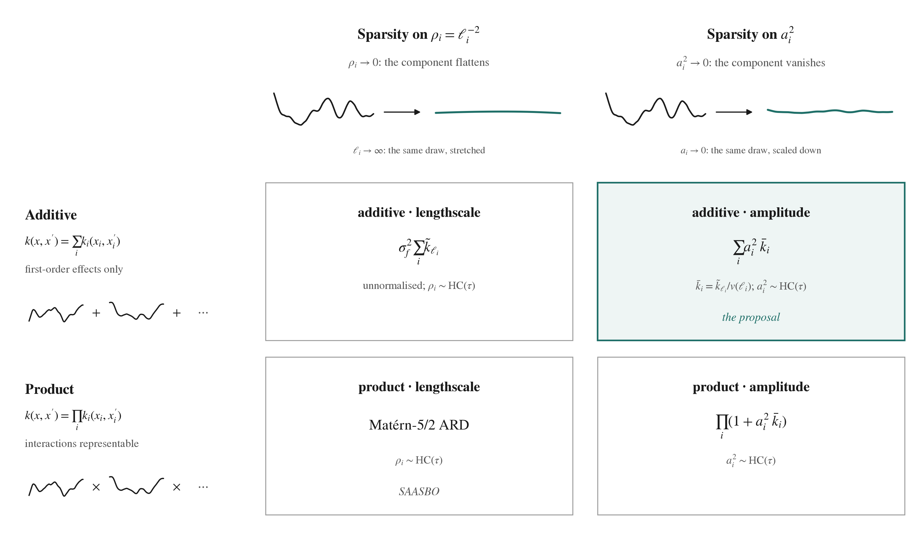

<!-- 23 slides for now (to be cut toward 15). Slide separators are `---`; math is LaTeX in $…$; `::: notes` blocks are speaker notes.
     Figures: fig_2x2.png (this folder) and ../../../latest/figures/*.png.
     Background slides 2 to 7 follow the project's primer (primary_research_question_primer.md) and research-question note;
     every number on the study slides is verbatim from claims_ledger.csv, NARRATIVE.md or Design-brief.md.
     Method abbreviations on results slides: PL / AL = product / additive lengthscale, PA / AA = product / additive amplitude. -->

# Amplitude or lengthscale?

## Sparse GP surrogates for 100-dimensional Bayesian optimisation

Background · a 2 × 2 of kernel structure × sparsity parameterisation · what it found

Quan · September 2026

::: notes
Background first, then the design, then the study. The punchline is that kernel structure matters more than where the sparsity prior sits, and that the identification readouts need repair before they can be trusted.
:::

---

# Bayesian optimisation, and why $D = 100$ breaks it

- Want $x^\star = \arg\max_{x \in [0,1]^D} f(x)$; $f$ expensive, no gradients, a few hundred evaluations
- Surrogate $f \sim \mathcal{GP}(m, k)$; posterior $\mu(x) = k(x, X)(K + \sigma_n^2 I)^{-1} y$, $\;\sigma^2(x) = k(x,x) - k(x, X)(K + \sigma_n^2 I)^{-1} k(X, x)$; hyperparameters $\theta$ from the marginal likelihood plus a prior $p(\theta)$
- Loop: Sobol initialisation, fit $\theta$, maximise an acquisition, evaluate, repeat. Expected improvement $(\mu - y^\star)\Phi(z) + \sigma\varphi(z)$, computed as LogEI so it does not underflow (Ament et al., 2023); score by simple regret $r_T = f(x^\star) - \max_{t \le T} f(x_t)$
- **Why high dimensions break it.** With fixed lengthscales the expected distance between random points grows like $\sqrt D$, so the kernel matrix approaches the identity: the model assumes a function so complex that no two observations inform each other (Hvarfner et al., 2024). Every high-dimensional BO method lowers that assumed complexity

::: notes
The audience knows GPs and BO; this slide fixes notation and the one argument from the recent literature that reframes everything: dimension is not the problem, assumed complexity is.
:::

---

# The landscape the study sits in

**2015 to 2022, structure.** Additive kernels with regret linear in $D$ (Kandasamy et al., 2015); all-order additive kernels (Duvenaud et al., 2011); identifiable orthogonal additive components, OAK (Lu et al., 2022); sparsity on inverse squared lengthscales with NUTS, SAASBO (Eriksson & Jankowiak, 2021), which became the standard strong baseline.

**2024 to 2026, pushback.** Scale the lengthscale prior with $\sqrt D$ and vanilla BO matches or beats structural methods (Hvarfner et al., 2024); initialisation rather than model class explained past failures (Xu et al., 2025); maximum likelihood with scaled initialisation and local candidate sampling suffices, and the popular benchmarks are simpler than their dimension suggests (Papenmeier et al., 2025); even Bayesian linear regression after a spherical projection is competitive (Doumont et al., 2026).

**Left open.** Nobody has crossed kernel family with sparsity parameterisation; every SAASBO-versus-vanilla comparison confounds the prior with the inference scheme (NUTS versus MAP); no sparsity prior has been placed on the amplitudes of an orthogonal additive GP; the oracle bound on the value of variable selection has not been reported; the interaction share at which additive sparsity stops paying has not been measured.

::: notes
Read chronologically the literature tells one story the study has to survive: structure helped, then the pushback said complexity control is enough. The five open items are exactly the study's questions.
:::

---

# Two notions of relevance

**Through lengthscales (ARD).** $k(x,x') = \sigma_f^2\bigl(1 + \sqrt5\, r + \tfrac53 r^2\bigr) e^{-\sqrt5\, r}$, $\;r^2 = \sum_i (x_i - x_i')^2 / \ell_i^2$. One global amplitude; $\ell_i \to \infty$ switches coordinate $i$ off (MacKay, Neal). But $\ell_i$ sets how *quickly* $f$ varies along $i$, not how *much*: relevance is roughness-weighted strength, and "large" cannot be separated from "rough".

**Through amplitudes (additive).** $f = \mu + \sum_i f_i(x_i)$, $\;f_i \sim \mathcal{GP}(0, a_i^2 \tilde k_i)$, $\;k = \sum_i a_i^2 \tilde k_i$. Two knobs per coordinate: $a_i$ how much, $\ell_i$ what shape. $a_i \to 0$ switches $i$ off regardless of $\ell_i$. With normalised components $a_i^2 = \mathrm{Var}_\nu f_i$: relevance is a **variance share**, the first-order Sobol index of functional ANOVA.

**The mechanism hypothesis.** Lengthscale shrinkage ties "small effect" to "smooth effect" (and, with a bounded global amplitude, "large" to "rough"); amplitude shrinkage leaves shape free. On the usual benchmarks the active coordinates are strong and rough against distractors that are exactly zero, so both priors pick the same set. Differences should appear only where strength and roughness are decoupled.

::: notes
This is the heart of the primary question. Relevance is not one concept; the two priors implement two criteria, and the study is about whether that matters for identification and for regret.
:::

---

# Sparsity priors, and why fully Bayesian

- **Spike-and-slab** is the ideal (point mass at zero or a diffuse slab), but posterior sampling is a search over $2^D$ models
- **Global-local shrinkage, the horseshoe** (Carvalho et al., 2009): $\beta_i \mid \lambda_i, \tau \sim \mathcal N(0, \lambda_i^2 \tau^2)$, $\;\lambda_i \sim \mathrm{C}^+(0,1)$, $\;\tau \sim \mathrm{C}^+(0, \tau_0)$. The shrinkage weight $\kappa_i = 1/(1 + \lambda_i^2\tau^2)$ is $\mathrm{Beta}(\tfrac12, \tfrac12)$: shrink to zero or leave alone
- **SAAS** (Eriksson & Jankowiak, 2021) applies it to $\rho_i = \ell_i^{-2}$:

$$\sigma_f^2 \sim \mathrm{LogNormal}(0, 10^2), \qquad \tau \sim \mathrm{C}^+(0, \alpha), \qquad \rho_i \sim \mathrm{C}^+(0, \tau), \qquad \alpha = 0.1$$

  Most $\rho_i$ sit below $\tau$, which concentrates near zero; as data accumulate, more coordinates turn on
- **Why fully Bayesian.** The density is unbounded at zero, so MAP collapses to "everything off". SAASBO's Fig. 2: NUTS beats MAP by a wide margin *although MAP finds the same relevant coordinates*, because the acquisition is averaged over posterior draws, modes included

::: notes
What sparsity buys, SAASBO Fig. 1: a dense GP at D about 100 with n about 100 reverts to the mean prediction; Hvarfner's reading is that what matters is the reduction in prior complexity, not sparsity as such. The non-centred parameterisation rho_i = tau times a standard half-Cauchy is what keeps NUTS out of the funnel.
:::

---

# Why a sparse additive GP, then

- **Additivity buys data.** Each $f_i$ is learned from all $n$ points projected onto $x_i$; under exact additivity the cumulative regret of BO grows linearly in $D$ rather than exponentially (Kandasamy et al., 2015)
- **Orthogonality buys identifiability.** Constraining $\int f_i\, \mathrm d\nu_i = 0$ (OAK, following Durrande et al., 2012) makes the decomposition unique: the GP components *are* the functional-ANOVA terms, and $\mathrm{Var} f = \sum_u \mathrm{Var} f_u$
- **Normalised amplitudes buy a readable posterior.** $a_i^2$ is the variance share, so a shrinkage prior on $a_i^2$ does variable selection in the quantity one wants to read. OAK ranks by the Sobol index of the posterior mean; this study does both and checks that they agree
- **The costs.** No interactions ($\gamma = 0$ assumed), and a predicted loss on benchmarks whose many coordinates carry weak, smooth, monotone effects, the structure of Lasso-DNA and MOPTA08 (Papenmeier et al., 2025)
- **The confound.** The headline contrast "additive + amplitude sparsity versus SAASBO" changes structure *and* parameterisation at once. Hence a crossed design

::: notes
Sparsity is a premise, not a finding: low effective dimension, and a sparse prior chosen for interpretability. Sparse-versus-dense is deliberately out of scope; the brief drops the complexity-matched column and says why.
:::

---

# Normalisation: the requirement the readout depends on

$v(\ell) = 1 - \mathbb{E}_{x,x' \sim \nu}\, k_\ell(x, x')$, the average marginal variance of a centered unit-amplitude Matérn-5/2 component:

| $\ell$ | 0.1 | 0.5 | 1 | 3 | 10 |
|---|---|---|---|---|---|
| $v(\ell)$ | 0.78 | 0.28 | 0.107 | 0.015 | 0.0014 |

- For large $\ell$, $v(\ell) \to 5/(36\ell^2)$ and the centered kernel collapses to the rank-one linear kernel $\tfrac{5}{3\ell^2}(x - \tfrac12)(x' - \tfrac12)$
- So $\mathrm{Var}_\nu f_i = a_i^2\, v(\ell_i)$, not $a_i^2$: a smooth component needs a *large* amplitude to carry a small variance, and $\ell_i \to \infty$ switches a component off with $a_i$ left wherever the prior puts it
- $\bar k_i = \tilde k_i / v(\ell_i)$ gives $\mathbb{E}_\nu \bar k_i(x,x) = 1$ and $\mathrm{Var}_\nu f_i = a_i^2$. Under normalisation $\ell_i \to \infty$ makes a component *linear*, not absent, so the lengthscale-sparse additive cell must use the unnormalised kernel

::: notes
This is the technical point the supervisor's note missed and that the whole relevance story depends on. One-component toy at n = 80 (kernel_normalization_check.py): a smooth component carrying 2 % of the variance gets a 45 % posterior probability of a > 0.3, and two components of equal variance get amplitudes 1.66 and 0.55; dividing by v(ell) brings those to 7 %, and 0.70 versus 0.52. The effect is specific to smoothness, as the mechanism predicts.
:::

---

# The problem, as this study poses it

- Bayesian optimisation at $D = 100$ with $T = 200$ noisy evaluations, $\sigma_{\text{noise}} = 0.1$; a 20-point Sobol initial design shared by every method within a seed
- Assumption taken: **low effective dimension along the axes**. $f$ depends on an active set $S$, $|S| = 3$ to $10$, unknown
- The surrogate must discover $S$ while optimising, and we want to read $S$ off the posterior afterwards

**Question.** How should the surrogate encode "coordinate $i$ is irrelevant", and does the choice change optimisation, identification of $S$, or both?

::: notes
Two jobs for one surrogate: find the optimum and find the subspace. Everything downstream is scored on both.
:::

---

# The lengthscale column: SAASBO as run here

- Matérn-5/2 ARD kernel with inverse squared lengthscales $\rho_i = \ell_i^{-2}$
- Sparse axis-aligned subspace prior, a global-local half-Cauchy scale mixture:

$$\tau \sim \mathrm{HC}(\alpha), \qquad \rho_i \sim \mathrm{HC}(\tau), \qquad \alpha = 0.1$$

- Most $\rho_i$ shrink to $0$: the coordinate goes flat. A few escape
- Fully Bayesian: NUTS over $(\rho, \sigma_f^2, \sigma_n^2)$; the acquisition is averaged over the draws
- Relevance in this parameterisation is a **slope**: $\mathbb{E}[(\partial_i f)^2] = \tfrac{5}{3}\, a_i^2 \rho_i$

::: notes
The lengthscale column of the design IS SAASBO. The whole study changes one thing at a time relative to it. Two deliberate departures from the reference implementation, stated once: Matérn-5/2 instead of RBF, and learned rather than fixed noise.
:::

---

# The amplitude column: sparsity on normalised amplitudes

One centered component per coordinate, divided by its average marginal variance:

$$v(\ell) = 1 - \mathbb{E}_{x,x'} k_\ell(x, x'), \qquad \bar k_i = \tilde k_{\ell_i} / v(\ell_i), \qquad \mathbb{E}\,\mathrm{Var}_\nu f_i = a_i^2$$

- $a_i^2 / \sum_j a_j^2$ is then the first-order Sobol index: the prior is a prior on **variance shares**
- Same prior form, moved: $a_i^2 \sim \mathrm{HC}(\tau)$, $\tau \sim \mathrm{HC}(\alpha)$, with $\alpha = 0.0131$ chosen so both priors imply the same prior-predictive number of active coordinates
- Lengthscales get a weakly informative $\mathrm{LogNormal}(0, 1.5)$ prior

**Two senses of relevance.** Slope $\mathbb{E}[(\partial_i f)^2] = \tfrac{5}{3} a_i^2 \rho_i$ versus share $\mathbb{E}\,\mathrm{Var}_\nu f_i = a_i^2 v(\ell_i)$: equal up to a constant for $\ell \gtrsim 1$, diverging as $\ell \to 0$.

::: notes
The one-line change is the normalisation. The last line is the hypothesis behind the decoupled family: rough coordinates look important to a lengthscale prior even when their share is small.
:::

---

# The 2 × 2 design

| | sparsity on $a_i^2$ | sparsity on $\rho_i = \ell_i^{-2}$ |
|---|---|---|
| **additive** | $k = \sum_i a_i^2 \bar k_i$ · *the proposal* | $k = \sigma_f^2 \sum_i \tilde k_{\ell_i}$, unnormalised |
| **product** | $k = \prod_i (1 + a_i^2 \bar k_i)$ | Matérn-5/2 ARD · *SAASBO* |

- The additive-lengthscale cell must stay unnormalised: it is the only additive parameterisation in which shrinking $\rho_i$ removes a component

::: notes
Rows: can the kernel represent interactions, and what does each component learn from. Columns: which parameter the half-Cauchy sits on. Bottom left is SAASBO, top right is the proposal, the other two complete the factorial. The product-amplitude cell is the full-order OAK kernel with shrinkage on a: multiplied out, the interaction among a set u has variance the product of its a squared, so a_i to 0 removes i from every interaction, exactly as rho_i to 0 does in SAASBO.
:::

---

# The questions, as preregistered in the brief

**Primary.** Holding kernel family (crossed), inference, acquisition, initialisation and budget fixed, does moving the sparsity prior from inverse squared lengthscales to normalised additive amplitudes change **(a)** which coordinates a fully Bayesian GP treats as relevant and **(b)** how sample-efficiently BO optimises sparse objectives, and **(c)** where does any such difference end as first-order additivity fails?

| | question | prediction |
|---|---|---|
| **SQ1** identification | which coordinates each cell calls relevant, and in which sense | **P1a** on aligned, all four cells select the same set (Jaccard $> 0.9$) · **P1b** on decoupled and anti-aligned, the amplitude column tracks the share $s_i$ (Spearman $> 0.8$), the lengthscale column tracks the slope share $g_i$ |
| **SQ2** sample efficiency | simple regret of the $2 \times 2$ in the loop | **P2** the structure main effect exceeds the parameterisation main effect on aligned; a parameterisation effect appears, if at all, on decoupled. Gate: oracle-$S$ versus DSP headroom must exceed two standard errors |
| **SQ3** boundary | the interaction share $\gamma^\star$ at which the additive advantage vanishes | **P3** $\gamma^\star \in (0.1, 0.5)$ at $T = 200$, the same for both parameterisations |

::: notes
Each prediction comes with a stated failure and a null thesis that would still be a thesis. What was run differs from the brief in two ways worth saying now: identification was read in the loop at t = 199 rather than offline on Sobol designs, and only gamma = 0.25 of the sweep ran.
:::

---

# Everything else held fixed

- Inference as in the SAASBO reference implementation: NumPyro NUTS, one chain per refit, 512 warm-up + 256 draws thinned to 16 retained, max_tree_depth 6, dense mass matrix
- Convergence gate per fit: split-$\hat R \le 1.1$, ESS $\ge 16$ on every sampled site, $\le 5$ divergences. **Excluded draws are still used to choose the next point**, so regret is valid for every run
- Acquisition: analytic LogEI averaged over the 16 draws (BoTorch, 512 raw samples, 5 restarts)
- References outside the factorial: **sobol**; **dsp_map**, an ARD Matérn-5/2 at the MAP under the dimension-scaled lengthscale prior (Hvarfner et al., 2024); **oracle_S**, the same MAP GP restricted to the true $S$
- $D = 100$, $T = 200$, 10 seeds; 4 families × 7 methods = 280 runs

::: notes
Everything that is not under study is identical across cells, and the one thing that could be confused with the thing under study, the kernel family, is crossed with it.
:::

---

# Synthetic objectives with exact ground truth

Each active coordinate carries a centered 1-D GP draw rescaled to an exact variance share:

$$f_i(x_i) = \sqrt{\frac{s_i}{\widehat{\mathrm{Var}}_\nu(g_i)}}\,\bigl(g_i(x_i) - \widehat{\mathbb{E}}_\nu g_i\bigr), \qquad g_i \sim \mathrm{GP}(0, \bar k_{\ell_i})$$

Interactions are products of centered unit-variance draws, orthogonal to every main effect: $h_{ij} = c_{ij} u_i(x_i) u_j(x_j)$, $\mathrm{Var}_\nu h_{ij} = c_{ij}^2$

$$f = \sum_{i \in S} f_i + \sum_{(i,j) \in I} h_{ij}, \qquad \sum_i s_i + \gamma = 1, \qquad y = f + \varepsilon,\ \varepsilon \sim \mathcal N(0, 0.1^2)$$

| family | active set | what it isolates |
|---|---|---|
| aligned3, aligned10 | 3 / 10 coordinates, equal shares, $\ell = 0.5$ | positive control |
| decoupled | 8: shares $0.21 \times 4$ and $0.04 \times 4$, crossed with $\ell = 1.5$ / $0.08$ | share and slope disagree |
| interaction_g0.25 | 5 with shares $0.15$, plus two pairs carrying $0.125$ each ($\gamma = 0.25$) | additivity failing |

::: notes
Active is defined once: share above 0.02. The families are in-family for the additive cells by construction; that is a known limitation, not a surprise. Anti-aligned, rotated, dense-weak and the external benchmarks in the brief were not run.
:::

---

# Readouts and statistics

- **Optimisation:** simple regret $r = f^\star - \text{best}_f$ at $t = 199$
- **Identification at $t = 199$:** average precision of ranking the 100 coordinates by the native score (posterior median of $\rho_i$ or $a_i^2$) or by $\widehat S_i$ (first-order Sobol indices of the posterior mean); precision and recall of the rule $p_{\text{active}} > 0.5$, where $p_{\text{active}}$ is the fraction of the 16 draws with share $> 0.02$ (equivalently $\rho > 0.152$, $\ell < 2.56$)
- **Pairing:** same objective and same 20 initial points within a seed; two-sided Wilcoxon signed-rank over 10 seeds. 10/10 gives $p = 0.002$; 8/10 gives $p = 0.11$ with a win-probability interval $[0.44, 0.97]$
- **Grades:** SUPPORTED $\ge 9/10$ and $p \le 0.01$ · SUGGESTIVE median favours and ($p \le 0.05$ or $\ge 8/10$) · NOT SUPPORTED otherwise

::: notes
Ten paired seeds establish a direction, not an effect size. Keep saying "in 10 of 10 seeds" rather than "significantly". 72 tests were run, so about 3.6 false positives are expected at p < 0.05 if nothing were real; the Holm correction is tabulated but not applied to the headline values.
:::

---

# SQ2: the structure-matched cell wins

- Every cell beats sobol 10/10 in every family · SUPPORTED
- **aligned10** medians: AA 0.0273, AL 0.0323, PA 0.0653, dsp_map 0.282, PL 0.289, oracle_S 0.429. AA beats PL, dsp_map and oracle_S 10/10 · SUPPORTED
- **decoupled:** AA 0.0581 … PL 0.465. AA beats oracle_S and PL 10/10; AL beats PL 10/10 · SUPPORTED
- **interaction_g0.25:** PL 0.000699, PA 0.00125, oracle_S 0.0119, AA 0.0173, AL 0.0214, dsp_map 0.415. Product vs additive 8/10 in all four pairings · SUGGESTIVE
- **aligned3:** every model-based method below 0.004; nothing distinguishable
- Parameterisation within a structure: NOT SUPPORTED, except AA over AL on decoupled, 9/10 · SUGGESTIVE

::: notes
Read the panels left to right. The additive cells win the additive families in every seed; the product cells lead once a quarter of the variance is interaction, but only at 8 of 10. Three active coordinates do not discriminate anything.
:::

---

# Why, as the study reads it

- PL's own readout sees about half of $S$ on the additive families: thresholded recall $0.53$ / $0.56$, median $\rho$ on $S$ $0.19$ / $0.29$ against the $0.152$ cutoff
- An ARD product kernel must resolve the joint 10-dimensional function from 200 points; the SAAS prior shrinks the lengthscales it cannot pin down, which removes real coordinates, and the acquisition optimises what remains
- The additive kernel learns $f_i$ from all $n$ points projected onto $x_i$: its data requirement grows with $|S|$, not with the joint function
- The gap opens early: at $t = 100$, AA 0.18 vs PL 0.48 on aligned10
- **Interaction:** the additive posterior mean is the additive projection of $f$, whose maximiser is not $f$'s; the regret floor of 0.017 to 0.021 is the price. Still twenty-fold below dsp_map: wrong-but-sparse beats right-but-vague at this $D$ and budget. The additive cells tie oracle_S there (4/6, $p = 0.56$)

::: notes
This slide is inference, not a tested claim; say so. The mechanism is consistent with the identification numbers on the next slides.
:::

---

# SQ1: ranking works, the thresholded rule does not

- Pooled AP by native score 0.89 to 0.97 across the cells (dsp_map 0.677), by $\widehat S_i$ 0.935 to 0.976; median AP 1.0 in every cell · SUPPORTED (descriptive)
- $p_{\text{active}} > 0.5$ is precise (0.92 to 1.00) but under-recalls: amplitude cells 0.25 / 0.51 on aligned10, 0.39 / 0.54 on decoupled; lengthscale cells 0.53 / 0.90 and 0.56 / 0.79
- **A units error.** The cells fit $y$ standardised over the BO design, whose std at $t = 199$ is 1.52 to 1.56 (aligned10) and 1.33 to 1.40 (decoupled). In model units a share is $\approx s_i / y_{\text{std}}^2$: $0.10 \to 0.042$, $\;0.04 \to 0.020$, the threshold itself
- Fix offline: threshold $a_i^2 \cdot y_{\text{std}}^2$

::: notes
P1a in these terms: on aligned3 all four cells reach AP 1.0 and F1 1.0 at t = 50; on aligned10 the rankings agree but the thresholded sets differ by cell (recall 0.25 to 0.90); Jaccard was not computed. The threshold was chosen against labels in uniform-measure units, and BO designs are not uniform. This is a readout bug, not a model property. On top of it the posterior a_i^2 on S sits below even the deflated value, 0.021 (AA) and 0.011 (PA) on aligned10 against 0.042; ranking survives because the off-S maximum is 0.0003 to 0.001.
:::

---

# P1b on decoupled: roughness versus importance

Fraction of the 20 coordinate-seed pairs per class detected by $p_{\text{active}} > 0.5$ / placed in the top 8 by native score:

| class (share, $\ell$) | PL | AL | PA | AA |
|---|---|---|---|---|
| high-share smooth (0.21, 1.5) | 0.90 / 0.95 | 0.95 / 1.00 | 0.45 / 0.95 | 0.70 / 0.95 |
| high-share rough (0.21, 0.08) | 0.80 / 0.95 | 1.00 / 1.00 | 0.95 / 1.00 | 0.95 / 1.00 |
| low-share smooth (0.04, 1.5) | 0.20 / 0.80 | 0.65 / 0.90 | 0.05 / 0.80 | 0.15 / 0.90 |
| low-share rough (0.04, 0.08) | 0.35 / 0.70 | 0.55 / 0.85 | 0.10 / 0.85 | 0.35 / 0.85 |

- Lengthscale native score orders by **roughness**: AL median $\rho$ 120 on high-rough vs 2.2 on high-smooth at equal share; native ranks 1.5 vs 5.0
- Amplitude orders by **importance**, roughness leaks in: AA $a_i^2$ 0.079 vs 0.038; PA detects high-smooth 45 % vs high-rough 95 %
- $\widehat S_i$ recovers the shares: AA 0.23 / 0.20 and 0.037 / 0.032 against true 0.21 / 0.04. Report $\widehat S_i$ as the share estimate

::: notes
P1b answered descriptively: the direction is right, the Spearman-against-labels readout was not computed, and anti_aligned, the sharp version, has not been run. Every cell places the high-share coordinates in its top eight at least 95 % of the time, so ranking by importance works in all four.
:::

---

# Diagnostics: what the sampler licenses

- **Amplitude cells never pass the gate:** 7,200 of 7,200 fits each. $\hat R_{\max}$ median 1.49 / 1.51, ESS$_{\min}$ median 6.1 / 5.9, against 1.1 and 16
- Failing sites are $a_i^2$ and $\ell_i$ ($\hat R$ 1.40 to 1.45, ESS 6.5 to 7); the global sites pass (1.04 to 1.05, ESS 36 to 38)
- Lengthscale cells fail marginally: 52.8 % / 59.3 % of fits, $\hat R$ median 1.10 / 1.11
- NUTS reaches max_tree_depth in 95.3 to 100 % of fits in every cell
- Structural reason: $2D + 3 = 203$ sampled sites against $D + 4 = 104$; the funnel of the $a_i^2$ scale mixture at $\alpha = 0.013$ is the likely geometric one (hypothesis)

**Survives:** regret (the loop used the draws it had; an unconverged posterior is a handicap, not an advantage) and ranking by native median. **Does not:** $p_{\text{active}}$, a fraction of 16 draws from about 6 effective ones, ranging 0.00 to 0.94 on the true aligned10 coordinates.

::: notes
Where both kinds of fit exist, in the lengthscale cells, non-convergence does cost identification: AP 0.90 / 0.94 for passing fits against 0.83 / 0.79 for excluded ones at t >= 100; the amplitude cells' excluded-only means, 0.85 and 0.88, sit in the same band.
:::

---

# Two things that look wrong

**An all-active posterior mode.** Additive-lengthscale on aligned3 declares all 100 coordinates active in 5 of 10 seeds, never before $t = 73$, intermittently (seed 02 alternates between 100 and 3 active).
- Collapsed draws: outputscale 0.0034, $\tau^2$ 82, $\rho$ 167 on $S$ and 121 off $S$; every coordinate carries a low-amplitude, short-lengthscale component
- Begins only after convergence (seed 08: regret 0.000019 since $t = 60$); single-chain $\hat R$ passes 6 of 7 collapsed readouts; $\widehat S_i$ is right in both modes (AP 1.00 / 0.92 vs 0.02 / 0.04 by $\rho$)
- Hypothesis: the unnormalised additive kernel's $\ell \to 0$ corner is a nearly white term that trades against the noise site; the amplitude cells carry an $\ell$ prior against exactly this, the lengthscale cells do not

**oracle_S is a weak oracle.** Loses 10/10 to AA on aligned10 (0.43 vs 0.027) and decoupled (0.44 vs 0.058): a MAP ARD GP on $S$ is a full-interaction model with the wrong bias on additive objectives. 8 to 24 % of its late queries are near-duplicates of an earlier query (cells: 0 to 1 %). The brief's headroom gate is not met as written.

::: notes
Neither affects regret. Both affect what may be reported: last-readout identification by rho, and any headroom argument built on oracle_S. For contrast, the sparse mode of the same seed has outputscale 0.48 with rho 2.3 on S and 7e-5 off S; the collapse trades a 140-fold smaller outputscale against a million-fold larger tau^2.
:::

---

# The brief's predictions, scored

| prediction | status after this study |
|---|---|
| **P1a** all four cells select the same set on aligned | Partly: rankings agree (median AP 1.0); thresholded sets differ by cell (recall 0.25 to 0.90); Jaccard not computed |
| **P1b** amplitude tracks share, lengthscale tracks slope | Consistent on decoupled, descriptively; anti-aligned not run |
| **P2** structure effect exceeds parameterisation effect | Consistent: structure SUPPORTED, parameterisation NOT SUPPORTED (SUGGESTIVE on decoupled) |
| **P3** $\gamma^\star \in (0.1, 0.5)$ | One point only: product leads at $\gamma = 0.25$, 8/10 (SUGGESTIVE); the sweep was not run |
| SQ2 headroom gate | Not met as written: oracle_S trails dsp_map; read as a weak oracle, not absent headroom |

::: notes
Back to the landscape slide: the study answers "does crossing structure with parameterisation change the picture" with "structure, yes; parameterisation, not yet shown", and the vanilla-with-scaled-prior baseline is beaten twenty-fold on the interaction family by a wrong-but-sparse structural prior.
:::

---

# Conclusions, and what to run next

- **Structure main effect** (P2): SUPPORTED. Additive cells win the additive families in 10/10 seeds; product cells lead at $\gamma = 0.25$ (SUGGESTIVE). Every cell beats quasi-random search
- **Parameterisation effect** within a structure: NOT SUPPORTED, except AA over AL on decoupled (SUGGESTIVE)
- **Identification:** all four cells rank $S$ well; $p_{\text{active}} > 0.5$ is not a calibrated decision (units + sampler); $\widehat S_i$ is the readout to report

Next, ordered by information per GPU-hour:
1. Re-score existing readouts: threshold $a_i^2\, y_{\text{std}}^2$, score by $\widehat S_i$ and by readouts pooled over the last $k$ iterations. Minutes of CPU
2. Sampler pilot on saved designs: 4 chains × 256 draws, max_tree_depth 8 and 10, non-centered reparameterisation. 1 to 5 GPU-hours
3. A structure-matched oracle on $S$. About 10 CPU-hours
4. Then more seeds where verdicts are SUGGESTIVE (150 to 300 GPU-hours), anti_aligned, the $\gamma$ sweep

**Scope.** Only four families ran; anti_aligned, rotated, the $\gamma$ sweep, dense_weak, Hartmann-6, Lasso-DNA and MOPTA08 did not. Cost so far: 1,944 GPU-hours, 1,584 of them acquisition.

::: notes
End on the ordering: the two cheapest items decide whether the amplitude cells' readouts can be trusted at all, and they cost almost nothing.
:::
