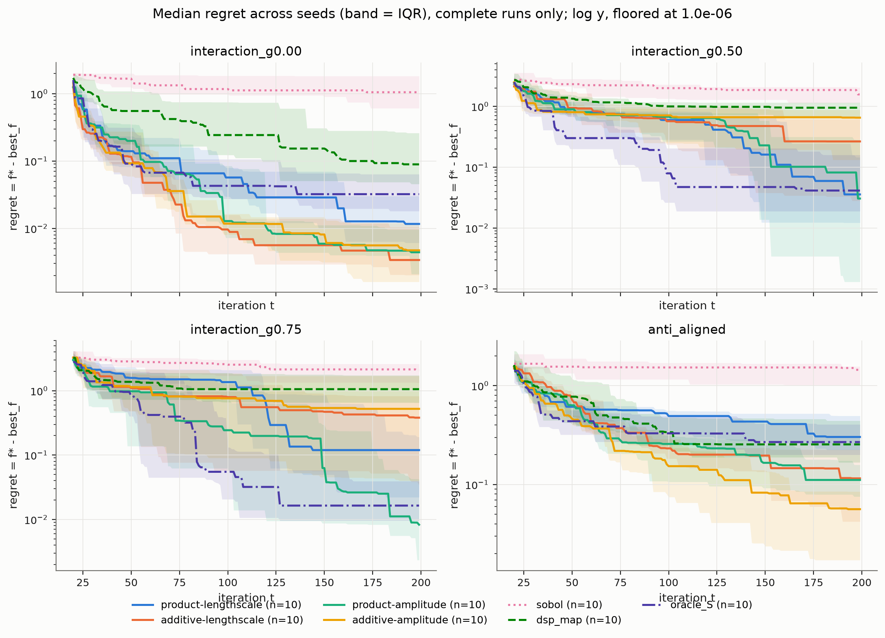
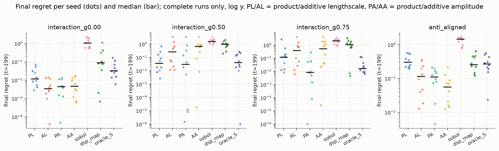
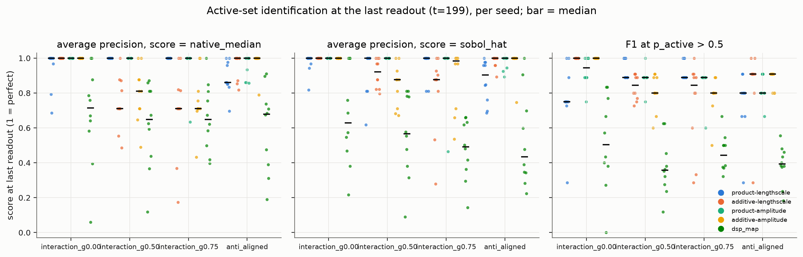
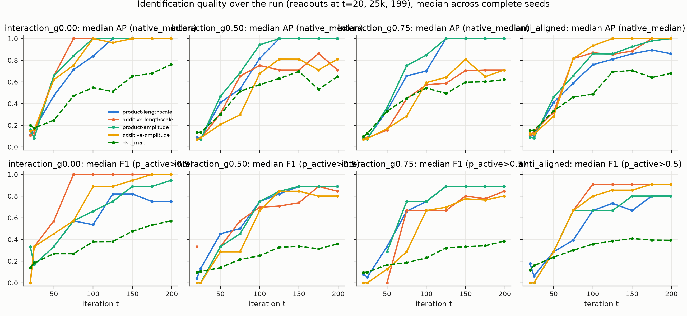
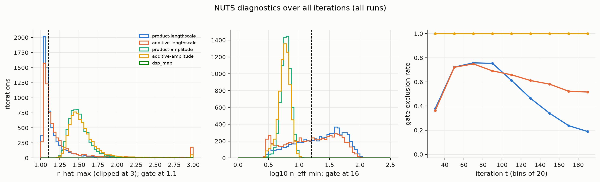
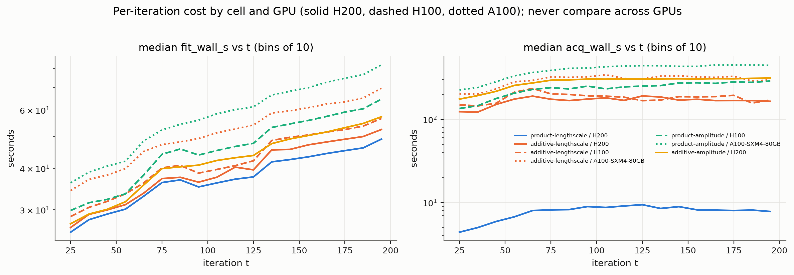

# sagp study analysis

As of **2026-09-25 12:42 EEST** (data: `/scratch/work/tranq8/saasbo/runs`; analysis dir `/scratch/work/tranq8/sagp_analysis/sagp2/2026-09-25-1242`; script `analyze.py`).

Runs: **280/280 complete** (180 rows). Incomplete: none.

Headline numbers use complete runs only. Seeds are paired: one (family, seed) is one objective and one shared initial design across all 7 methods.

<!-- TOP5 -->

## What changed since the previous analysis

No previous analysis directory found: this is the first run, nothing to diff against.

## 1. Inventory

| method | runs | complete | rows |
|---|---|---|---|
| product-lengthscale | 40 | 40 | 7200 |
| additive-lengthscale | 40 | 40 | 7200 |
| product-amplitude | 40 | 40 | 7200 |
| additive-amplitude | 40 | 40 | 7200 |
| sobol | 40 | 40 | 7200 |
| dsp_map | 40 | 40 | 7200 |
| oracle_S | 40 | 40 | 7200 |

Objectives: D = 100, noise_sd = 0.1; |S| per family {'interaction_g0.00': [5], 'interaction_g0.50': [5], 'interaction_g0.75': [5], 'anti_aligned': [6]}; gamma per family {'interaction_g0.00': [0.0], 'interaction_g0.50': [0.5], 'interaction_g0.75': [0.7499999999999999], 'anti_aligned': [0.0]}. Distinct config_hash values: 280 (one per run; the hash covers the objective and the method). Git commits: ['2866ed2'].

Devices at creation (runs): {'NVIDIA H200': 132, 'cpu': 120, 'NVIDIA A100-SXM4-80GB': 16, 'NVIDIA H100 80GB HBM3': 12}. Runs whose iterations span more than one GPU type (resumed onto a different partition): 34. Resumes per run: {0: 126, 1: 154} (most `resumed` entries are no-op resumes at t=200 recorded by the chain's later Slurm links).

## 2. Sanity checks

| check | n_runs | n_pass | n_fail | failing_runs |
|---|---|---|---|---|
| rows_180 | 280 | 280 | 0 |  |
| no_dup_t | 280 | 280 | 0 |  |
| t_contiguous | 280 | 280 | 0 |  |
| regret_nonincreasing | 280 | 280 | 0 |  |
| best_f_nondecreasing | 280 | 280 | 0 |  |
| best_f_ge_cummax_f | 280 | 280 | 0 |  |
| regret_eq_fstar_minus_bestf | 280 | 280 | 0 |  |
| regret_nonnegative | 280 | 280 | 0 |  |
| log_resumes_eq_manifest | 280 | 280 | 0 |  |
| log_t_set_eq_csv | 280 | 280 | 0 |  |
| f_star_identical | 40 | 40 | 0 |  |
| S_identical | 40 | 40 | 0 |  |
| y_mean_t20_identical | 40 | 40 | 0 |  |
| y_std_t20_identical | 40 | 40 | 0 |  |

`best_f_ge_cummax_f` is a lower-bound check because best_f also covers the 20-point initial design, which is not a row. `regret_eq_fstar_minus_bestf` checks the CSV's regret against manifest.objective.f_star to 1e-9. `log_resumes_eq_manifest` and `log_t_set_eq_csv` verify that log.txt's resume lines match manifest.resumed and that every iteration in the CSV appears once in the log (device attribution relies on this).

## 3. Optimization performance

Final regret at t=199, median [Q1, Q3] across complete seeds, ranked within family (1 = best):

| family | method | n | median_iqr | rank_in_family | mean_rank_within_seed |
|---|---|---|---|---|---|
| anti_aligned | additive-amplitude | 10 | 0.0563 [0.0172, 0.0849] | 1 | 1.9 |
| anti_aligned | product-amplitude | 10 | 0.111 [0.0756, 0.158] | 2 | 2.4 |
| anti_aligned | additive-lengthscale | 10 | 0.115 [0.0422, 0.225] | 3 | 2.7 |
| anti_aligned | dsp_map | 10 | 0.255 [0.168, 0.441] | 4 | 4.3 |
| anti_aligned | oracle_S | 10 | 0.269 [0.2, 0.405] | 5 | 4.6 |
| anti_aligned | product-lengthscale | 10 | 0.302 [0.224, 0.495] | 6 | 5.1 |
| anti_aligned | sobol | 10 | 1.44 [1.02, 1.56] | 7 | 7 |
| interaction_g0.00 | additive-lengthscale | 10 | 0.00339 [0.00202, 0.0104] | 1 | 2.2 |
| interaction_g0.00 | product-amplitude | 10 | 0.00441 [0.0021, 0.00958] | 2 | 2.1 |
| interaction_g0.00 | additive-amplitude | 10 | 0.00472 [0.00161, 0.012] | 3 | 2.7 |
| interaction_g0.00 | product-lengthscale | 10 | 0.0116 [0.0061, 0.0302] | 4 | 4.05 |
| interaction_g0.00 | oracle_S | 10 | 0.0322 [0.0181, 0.0637] | 5 | 5.05 |
| interaction_g0.00 | dsp_map | 10 | 0.0891 [0.0455, 0.26] | 6 | 4.9 |
| interaction_g0.00 | sobol | 10 | 1.05 [0.607, 1.83] | 7 | 7 |
| interaction_g0.50 | product-amplitude | 10 | 0.0305 [0.0013, 0.283] | 1 | 2.8 |
| interaction_g0.50 | product-lengthscale | 10 | 0.0356 [0.0122, 0.145] | 2 | 2.7 |
| interaction_g0.50 | oracle_S | 10 | 0.0413 [0.0189, 0.159] | 3 | 2.8 |
| interaction_g0.50 | additive-lengthscale | 10 | 0.265 [0.028, 0.616] | 4 | 3.4 |
| interaction_g0.50 | additive-amplitude | 10 | 0.65 [0.132, 0.875] | 5 | 4.2 |
| interaction_g0.50 | dsp_map | 10 | 0.949 [0.634, 1.15] | 6 | 5.5 |
| interaction_g0.50 | sobol | 10 | 1.57 [1.14, 2.05] | 7 | 6.6 |
| interaction_g0.75 | product-amplitude | 10 | 0.00828 [0.00234, 0.0421] | 1 | 1.8 |
| interaction_g0.75 | oracle_S | 10 | 0.0164 [0.00958, 0.0393] | 2 | 3 |
| interaction_g0.75 | product-lengthscale | 10 | 0.119 [0.0221, 0.191] | 3 | 3.8 |
| interaction_g0.75 | additive-lengthscale | 10 | 0.381 [0.0341, 0.825] | 4 | 4 |
| interaction_g0.75 | additive-amplitude | 10 | 0.522 [0.04, 1.69] | 5 | 4.1 |
| interaction_g0.75 | dsp_map | 10 | 1.06 [0.65, 1.74] | 6 | 4.8 |
| interaction_g0.75 | sobol | 10 | 2.06 [1.33, 2.61] | 7 | 6.5 |

## 4. Paired comparisons (Wilcoxon signed-rank over seeds, final regret at t=199)

`median_diff` = median over seeds of (cell regret - reference regret); negative means the cell is better. Two-sided p-values from scipy.stats.wilcoxon (exact for n=10 without ties). **10 seeds is small**: the smallest attainable two-sided p is 0.002, and a single wild seed moves the median. Raw p-values are NOT corrected for multiple comparisons; `p_holm_within_family_kind` is a Holm correction over the 12 cell-vs-reference tests (or 6 cell-vs-cell tests) inside each family, shown for reference only.

| family | cell | reference | n_seeds | median_diff | n_cell_better | n_ref_better | p_value | p_holm_within_family_kind |
|---|---|---|---|---|---|---|---|---|
| interaction_g0.00 | product-lengthscale | sobol | 10 | -1.01 | 10 | 0 | 0.00195 | 0.0234 |
| interaction_g0.00 | product-lengthscale | dsp_map | 10 | -0.0721 | 7 | 3 | 0.0371 | 0.0742 |
| interaction_g0.00 | product-lengthscale | oracle_S | 10 | -0.00303 | 6 | 3 | 0.203 | 0.203 |
| interaction_g0.00 | additive-lengthscale | sobol | 10 | -1.05 | 10 | 0 | 0.00195 | 0.0234 |
| interaction_g0.00 | additive-lengthscale | dsp_map | 10 | -0.0868 | 8 | 2 | 0.00977 | 0.0391 |
| interaction_g0.00 | additive-lengthscale | oracle_S | 10 | -0.0195 | 10 | 0 | 0.00195 | 0.0234 |
| interaction_g0.00 | product-amplitude | sobol | 10 | -1.04 | 10 | 0 | 0.00195 | 0.0234 |
| interaction_g0.00 | product-amplitude | dsp_map | 10 | -0.0825 | 10 | 0 | 0.00195 | 0.0234 |
| interaction_g0.00 | product-amplitude | oracle_S | 10 | -0.0308 | 10 | 0 | 0.00195 | 0.0234 |
| interaction_g0.00 | additive-amplitude | sobol | 10 | -1.04 | 10 | 0 | 0.00195 | 0.0234 |
| interaction_g0.00 | additive-amplitude | dsp_map | 10 | -0.0792 | 8 | 2 | 0.00977 | 0.0391 |
| interaction_g0.00 | additive-amplitude | oracle_S | 10 | -0.026 | 10 | 0 | 0.00195 | 0.0234 |
| interaction_g0.50 | product-lengthscale | sobol | 10 | -1.44 | 10 | 0 | 0.00195 | 0.0234 |
| interaction_g0.50 | product-lengthscale | dsp_map | 10 | -0.878 | 10 | 0 | 0.00195 | 0.0234 |
| interaction_g0.50 | product-lengthscale | oracle_S | 10 | 0 | 4 | 3 | 0.812 | 1 |
| interaction_g0.50 | additive-lengthscale | sobol | 10 | -1.06 | 9 | 1 | 0.00391 | 0.0391 |
| interaction_g0.50 | additive-lengthscale | dsp_map | 10 | -0.196 | 8 | 2 | 0.193 | 0.967 |
| interaction_g0.50 | additive-lengthscale | oracle_S | 10 | 0.205 | 5 | 5 | 0.232 | 0.967 |
| interaction_g0.50 | product-amplitude | sobol | 10 | -1.13 | 9 | 1 | 0.00391 | 0.0391 |
| interaction_g0.50 | product-amplitude | dsp_map | 10 | -0.528 | 9 | 1 | 0.0645 | 0.451 |
| interaction_g0.50 | product-amplitude | oracle_S | 10 | 4.03e-06 | 4 | 5 | 0.652 | 1 |
| interaction_g0.50 | additive-amplitude | sobol | 10 | -1.11 | 9 | 1 | 0.00391 | 0.0391 |
| interaction_g0.50 | additive-amplitude | dsp_map | 10 | -0.0968 | 7 | 3 | 0.322 | 0.967 |
| interaction_g0.50 | additive-amplitude | oracle_S | 10 | 0.631 | 3 | 7 | 0.0645 | 0.451 |
| interaction_g0.75 | product-lengthscale | sobol | 10 | -1.92 | 9 | 1 | 0.0195 | 0.137 |
| interaction_g0.75 | product-lengthscale | dsp_map | 10 | -0.623 | 8 | 2 | 0.00977 | 0.107 |
| interaction_g0.75 | product-lengthscale | oracle_S | 10 | 0.0574 | 2 | 5 | 0.0781 | 0.371 |
| interaction_g0.75 | additive-lengthscale | sobol | 10 | -1.16 | 9 | 1 | 0.0137 | 0.109 |
| interaction_g0.75 | additive-lengthscale | dsp_map | 10 | -0.365 | 6 | 4 | 0.275 | 0.826 |
| interaction_g0.75 | additive-lengthscale | oracle_S | 10 | 0.352 | 3 | 6 | 0.0742 | 0.371 |
| interaction_g0.75 | product-amplitude | sobol | 10 | -2.06 | 10 | 0 | 0.00195 | 0.0234 |
| interaction_g0.75 | product-amplitude | dsp_map | 10 | -0.919 | 8 | 2 | 0.00977 | 0.107 |
| interaction_g0.75 | product-amplitude | oracle_S | 10 | -0.00751 | 8 | 2 | 0.322 | 0.826 |
| interaction_g0.75 | additive-amplitude | sobol | 10 | -0.997 | 9 | 1 | 0.00977 | 0.107 |
| interaction_g0.75 | additive-amplitude | dsp_map | 10 | -0.358 | 6 | 4 | 0.322 | 0.826 |
| interaction_g0.75 | additive-amplitude | oracle_S | 10 | 0.507 | 3 | 7 | 0.0371 | 0.223 |
| anti_aligned | product-lengthscale | sobol | 10 | -1.01 | 10 | 0 | 0.00195 | 0.0234 |
| anti_aligned | product-lengthscale | dsp_map | 10 | 0.102 | 4 | 6 | 0.695 | 0.695 |
| anti_aligned | product-lengthscale | oracle_S | 10 | 0.0356 | 3 | 7 | 0.193 | 0.422 |
| anti_aligned | additive-lengthscale | sobol | 10 | -1.26 | 10 | 0 | 0.00195 | 0.0234 |
| anti_aligned | additive-lengthscale | dsp_map | 10 | -0.2 | 6 | 4 | 0.131 | 0.422 |
| anti_aligned | additive-lengthscale | oracle_S | 10 | -0.168 | 8 | 2 | 0.105 | 0.422 |
| anti_aligned | product-amplitude | sobol | 10 | -1.36 | 10 | 0 | 0.00195 | 0.0234 |
| anti_aligned | product-amplitude | dsp_map | 10 | -0.143 | 9 | 1 | 0.00586 | 0.0352 |
| anti_aligned | product-amplitude | oracle_S | 10 | -0.165 | 9 | 1 | 0.00586 | 0.0352 |
| anti_aligned | additive-amplitude | sobol | 10 | -1.39 | 10 | 0 | 0.00195 | 0.0234 |
| anti_aligned | additive-amplitude | dsp_map | 10 | -0.203 | 10 | 0 | 0.00195 | 0.0234 |
| anti_aligned | additive-amplitude | oracle_S | 10 | -0.16 | 10 | 0 | 0.00195 | 0.0234 |

Cell-vs-cell (extra, same test):

| family | cell | reference | n_seeds | median_diff | n_cell_better | n_ref_better | p_value | p_holm_within_family_kind |
|---|---|---|---|---|---|---|---|---|
| interaction_g0.00 | product-lengthscale | additive-lengthscale | 10 | 0.00887 | 2 | 8 | 0.0273 | 0.137 |
| interaction_g0.00 | product-lengthscale | product-amplitude | 10 | 0.00744 | 2 | 8 | 0.00977 | 0.0586 |
| interaction_g0.00 | product-lengthscale | additive-amplitude | 10 | 0.00721 | 2 | 8 | 0.0645 | 0.258 |
| interaction_g0.00 | additive-lengthscale | product-amplitude | 10 | 0.000207 | 5 | 5 | 0.922 | 1 |
| interaction_g0.00 | additive-lengthscale | additive-amplitude | 10 | -0.000391 | 7 | 3 | 0.557 | 1 |
| interaction_g0.00 | product-amplitude | additive-amplitude | 10 | -0.00133 | 6 | 4 | 0.625 | 1 |
| interaction_g0.50 | product-lengthscale | additive-lengthscale | 10 | -0.0246 | 5 | 5 | 0.322 | 0.967 |
| interaction_g0.50 | product-lengthscale | product-amplitude | 10 | 0.00878 | 4 | 5 | 0.734 | 0.967 |
| interaction_g0.50 | product-lengthscale | additive-amplitude | 10 | -0.343 | 8 | 2 | 0.0371 | 0.223 |
| interaction_g0.50 | additive-lengthscale | product-amplitude | 10 | 0.0301 | 3 | 7 | 0.131 | 0.654 |
| interaction_g0.50 | additive-lengthscale | additive-amplitude | 10 | -0.0235 | 6 | 4 | 0.375 | 0.967 |
| interaction_g0.50 | product-amplitude | additive-amplitude | 10 | -0.116 | 7 | 3 | 0.131 | 0.654 |
| interaction_g0.75 | product-lengthscale | additive-lengthscale | 10 | -0.23 | 5 | 4 | 0.359 | 1 |
| interaction_g0.75 | product-lengthscale | product-amplitude | 10 | 0.103 | 1 | 9 | 0.0488 | 0.195 |
| interaction_g0.75 | product-lengthscale | additive-amplitude | 10 | -0.418 | 5 | 5 | 0.432 | 1 |
| interaction_g0.75 | additive-lengthscale | product-amplitude | 10 | 0.335 | 1 | 9 | 0.00977 | 0.0586 |
| interaction_g0.75 | additive-lengthscale | additive-amplitude | 10 | -0.00798 | 6 | 4 | 0.432 | 1 |
| interaction_g0.75 | product-amplitude | additive-amplitude | 10 | -0.386 | 8 | 2 | 0.0273 | 0.137 |
| anti_aligned | product-lengthscale | additive-lengthscale | 10 | 0.217 | 1 | 9 | 0.00391 | 0.0195 |
| anti_aligned | product-lengthscale | product-amplitude | 10 | 0.214 | 0 | 10 | 0.00195 | 0.0117 |
| anti_aligned | product-lengthscale | additive-amplitude | 10 | 0.233 | 1 | 9 | 0.00391 | 0.0195 |
| anti_aligned | additive-lengthscale | product-amplitude | 10 | -0.0288 | 6 | 4 | 1 | 1 |
| anti_aligned | additive-lengthscale | additive-amplitude | 10 | 0.00283 | 4 | 6 | 0.432 | 1 |
| anti_aligned | product-amplitude | additive-amplitude | 10 | 0.00165 | 4 | 6 | 0.375 | 1 |

## 5. Identification of the active set (the study's real question)

Scored at the LAST readout of each run (coords.csv rows are written every iteration; sobol_hat is computed at t = 25, 50, ..., 175 and 199). `native_median` is the cell's own sparsity parameter (rho_i = 1/ell_i^2 for the lengthscale cells, a_sq_i for the amplitude cells; dsp_map: its MAP rho), so higher = more active in every cell. AP = average precision of ranking the 100 coordinates by the score; recall@|S| = fraction of the true S inside the top-|S| coordinates. Thresholded metrics use p_active > 0.5. oracle_S is included as a metric check (must be perfect); sobol has no model and no readout.

Per cell (all families pooled), median and mean over complete runs:

| method | n_runs | ap_native_median | ap_native_mean | recall_at_S_native_mean | ap_sobol_mean | recall_at_S_sobol_mean | precision_mean | recall_mean | f1_mean | n_pred_active_median |
|---|---|---|---|---|---|---|---|---|---|---|
| product-lengthscale | 40 | 1 | 0.958 | 0.943 | 0.932 | 0.905 | 0.979 | 0.759 | 0.841 | 4 |
| additive-lengthscale | 40 | 0.938 | 0.85 | 0.872 | 0.925 | 0.893 | 0.919 | 0.841 | 0.858 | 5 |
| product-amplitude | 40 | 1 | 0.979 | 0.973 | 0.981 | 0.978 | 0.99 | 0.794 | 0.877 | 4 |
| additive-amplitude | 40 | 1 | 0.881 | 0.892 | 0.925 | 0.907 | 0.909 | 0.836 | 0.866 | 5 |
| dsp_map | 40 | 0.674 | 0.638 | 0.615 | 0.556 | 0.562 | 0.321 | 0.768 | 0.43 | 13.5 |
| oracle_S | 40 | 1 | 1 | 1 | 0.977 | 0.976 | 1 | 0.748 | 0.846 | 4 |

Per cell and family (mean over seeds):

| method | family | n_runs | ap_native_mean | recall_at_S_native_mean | ap_sobol_mean | recall_at_S_sobol_mean | precision_mean | recall_mean | f1_mean | n_pred_active_median |
|---|---|---|---|---|---|---|---|---|---|---|
| product-lengthscale | anti_aligned | 10 | 0.889 | 0.833 | 0.87 | 0.8 | 1 | 0.617 | 0.744 | 4 |
| product-lengthscale | interaction_g0.00 | 10 | 0.945 | 0.94 | 0.973 | 0.94 | 0.917 | 0.68 | 0.765 | 3 |
| product-lengthscale | interaction_g0.50 | 10 | 1 | 1 | 0.924 | 0.92 | 1 | 0.88 | 0.933 | 4 |
| product-lengthscale | interaction_g0.75 | 10 | 1 | 1 | 0.962 | 0.96 | 1 | 0.86 | 0.922 | 4 |
| additive-lengthscale | anti_aligned | 10 | 0.954 | 0.95 | 0.981 | 0.95 | 1 | 0.783 | 0.854 | 5 |
| additive-lengthscale | interaction_g0.00 | 10 | 1 | 1 | 1 | 1 | 1 | 1 | 1 | 5 |
| additive-lengthscale | interaction_g0.50 | 10 | 0.744 | 0.78 | 0.913 | 0.84 | 0.839 | 0.86 | 0.835 | 5.5 |
| additive-lengthscale | interaction_g0.75 | 10 | 0.701 | 0.76 | 0.808 | 0.78 | 0.837 | 0.72 | 0.742 | 5 |
| product-amplitude | anti_aligned | 10 | 0.951 | 0.933 | 0.976 | 0.95 | 1 | 0.717 | 0.83 | 4 |
| product-amplitude | interaction_g0.00 | 10 | 1 | 1 | 1 | 1 | 1 | 0.88 | 0.931 | 4.5 |
| product-amplitude | interaction_g0.50 | 10 | 1 | 1 | 1 | 1 | 1 | 0.8 | 0.886 | 4 |
| product-amplitude | interaction_g0.75 | 10 | 0.963 | 0.96 | 0.946 | 0.96 | 0.96 | 0.78 | 0.86 | 4 |
| additive-amplitude | anti_aligned | 10 | 0.979 | 0.967 | 0.975 | 0.967 | 1 | 0.783 | 0.876 | 5 |
| additive-amplitude | interaction_g0.00 | 10 | 1 | 1 | 1 | 1 | 1 | 1 | 1 | 5 |
| additive-amplitude | interaction_g0.50 | 10 | 0.793 | 0.8 | 0.843 | 0.8 | 0.822 | 0.8 | 0.806 | 5 |
| additive-amplitude | interaction_g0.75 | 10 | 0.753 | 0.8 | 0.884 | 0.86 | 0.813 | 0.76 | 0.781 | 5 |
| dsp_map | anti_aligned | 10 | 0.598 | 0.6 | 0.526 | 0.55 | 0.276 | 0.733 | 0.389 | 16.5 |
| dsp_map | interaction_g0.00 | 10 | 0.677 | 0.64 | 0.663 | 0.66 | 0.395 | 0.82 | 0.516 | 9.5 |
| dsp_map | interaction_g0.50 | 10 | 0.616 | 0.58 | 0.557 | 0.56 | 0.262 | 0.76 | 0.375 | 14 |
| dsp_map | interaction_g0.75 | 10 | 0.66 | 0.64 | 0.477 | 0.48 | 0.353 | 0.76 | 0.439 | 11 |
| oracle_S | anti_aligned | 10 | 1 | 1 | 0.984 | 0.983 | 1 | 0.633 | 0.765 | 4 |
| oracle_S | interaction_g0.00 | 10 | 1 | 1 | 1 | 1 | 1 | 0.66 | 0.785 | 3 |
| oracle_S | interaction_g0.50 | 10 | 1 | 1 | 0.962 | 0.96 | 1 | 0.86 | 0.922 | 4 |
| oracle_S | interaction_g0.75 | 10 | 1 | 1 | 0.962 | 0.96 | 1 | 0.84 | 0.911 | 4 |

Best cell per family:

| family | best_ap_native | best_ap_sobol | best_f1 | order_by_ap_native |
|---|---|---|---|---|
| interaction_g0.00 | additive-lengthscale | additive-lengthscale | additive-lengthscale | additive-lengthscale > product-amplitude > additive-amplitude > product-lengthscale |
| interaction_g0.50 | product-lengthscale | product-amplitude | product-lengthscale | product-lengthscale > product-amplitude > additive-amplitude > additive-lengthscale |
| interaction_g0.75 | product-lengthscale | product-lengthscale | product-lengthscale | product-lengthscale > product-amplitude > additive-amplitude > additive-lengthscale |
| anti_aligned | additive-amplitude | additive-lengthscale | additive-amplitude | additive-amplitude > additive-lengthscale > product-amplitude > product-lengthscale |

Runs whose t=199 readout came from a gate-excluded fit, per method: {'additive-amplitude': 40, 'additive-lengthscale': 20, 'dsp_map': 2, 'oracle_S': 0, 'product-amplitude': 40, 'product-lengthscale': 10}.

## 6. Diagnostics

Per method, all iterations of all runs (gate: split-R-hat <= 1.1, ESS >= 16 on every sampled site, <= 5 divergences):

| method | n_iter | gate_excluded_rate | exception_rows | r_hat_max_q10 | r_hat_max_median | r_hat_max_q90 | n_eff_min_q10 | n_eff_min_median | n_eff_min_q90 | divergences_mean | divergences_gt5_frac |
|---|---|---|---|---|---|---|---|---|---|---|---|
| product-lengthscale | 7200 | 0.495 | 0 | 1.04 | 1.09 | 1.39 | 5.85 | 24.8 | 63 | 0.177 | 0.00306 |
| additive-lengthscale | 7200 | 0.602 | 0 | 1.04 | 1.12 | 1.67 | 3.97 | 17.7 | 54.1 | 0.291 | 0.00889 |
| product-amplitude | 7200 | 1 | 0 | 1.36 | 1.48 | 1.68 | 4.84 | 6.16 | 7.76 | 0.122 | 0.00167 |
| additive-amplitude | 7200 | 1 | 0 | 1.37 | 1.51 | 1.77 | 4.38 | 5.87 | 7.5 | 0.118 | 0.00347 |
| sobol | 7200 | 0 | 0 | nan | nan | nan | nan | nan | nan | nan | 0 |
| dsp_map | 7200 | 0 | 38 | nan | nan | nan | nan | nan | nan | nan | 0 |
| oracle_S | 7200 | 0 | 0 | nan | nan | nan | nan | nan | nan | nan | 0 |

Sampler effort (num_steps_mean = leapfrog steps per NUTS iteration, max 63 at max_tree_depth = 6; fit_calls > 1 means a retry):

| method | num_steps_mean_median | frac_at_tree_cap | fit_calls_mean | nuts_attempts_mean |
|---|---|---|---|---|
| product-lengthscale | 62.9 | 0.946 | 1 | 1 |
| additive-lengthscale | 62.9 | 0.965 | 1 | 1 |
| product-amplitude | 63 | 0.999 | 1 | 1 |
| additive-amplitude | 63 | 0.998 | 1 | 1 |

Identification quality of readouts at t >= 100 split by whether that fit passed the gate (cells; the amplitude cells have no passing fits):

| method | gate_excluded | n_readouts | ap_native_mean | ap_native_median | f1_mean |
|---|---|---|---|---|---|
| additive-amplitude | excluded | 200 | 0.824 | 0.877 | 0.801 |
| additive-lengthscale | passed | 83 | 0.892 | 1 | 0.89 |
| additive-lengthscale | excluded | 117 | 0.756 | 0.81 | 0.772 |
| product-amplitude | excluded | 200 | 0.938 | 1 | 0.812 |
| product-lengthscale | passed | 115 | 0.947 | 1 | 0.805 |
| product-lengthscale | excluded | 85 | 0.835 | 0.86 | 0.727 |

Which site fails (medians of the per-site diagnostics):

| method | r_hat_max_native_median | r_hat_max_ell_median | r_hat_max_global_median | n_eff_min_native_median | n_eff_min_ell_median | n_eff_min_global_median | frac_r_hat_below_1_05_median |
|---|---|---|---|---|---|---|---|
| product-lengthscale | 1.09 | nan | 1.01 | 24.8 | nan | 114 | 0.971 |
| additive-lengthscale | 1.12 | nan | 1.02 | 17.8 | nan | 73.7 | 0.942 |
| product-amplitude | 1.4 | 1.44 | 1.05 | 7.05 | 6.7 | 35.7 | 0.64 |
| additive-amplitude | 1.43 | 1.45 | 1.04 | 6.59 | 6.5 | 36.2 | 0.631 |

Gate reason breakdown (iterations):

| method | divergences | exception | fit_gpytorch_mll+Adam | n_eff_min | n_eff_min+divergences | ok | r_hat_max | r_hat_max+divergences | r_hat_max+n_eff_min | r_hat_max+n_eff_min+divergences |
|---|---|---|---|---|---|---|---|---|---|---|
| product-lengthscale | 0 | 0 | 0 | 249 | 0 | 3635 | 971 | 4 | 2323 | 18 |
| additive-lengthscale | 2 | 0 | 0 | 196 | 1 | 2869 | 975 | 1 | 3096 | 60 |
| product-amplitude | 0 | 0 | 0 | 0 | 0 | 0 | 0 | 0 | 7188 | 12 |
| additive-amplitude | 0 | 0 | 0 | 0 | 0 | 0 | 0 | 0 | 7175 | 25 |
| dsp_map | 0 | 38 | 133 | 0 | 0 | 7029 | 0 | 0 | 0 | 0 |

Per method and family:

| method | family | n_iter | gate_excluded_rate | exception_rows | r_hat_max_median | n_eff_min_median | divergences_mean |
|---|---|---|---|---|---|---|---|
| product-lengthscale | anti_aligned | 1800 | 0.478 | 0 | 1.09 | 26.2 | 0.157 |
| product-lengthscale | interaction_g0.00 | 1800 | 0.471 | 0 | 1.09 | 26.4 | 0.129 |
| product-lengthscale | interaction_g0.50 | 1800 | 0.518 | 0 | 1.1 | 21.9 | 0.0406 |
| product-lengthscale | interaction_g0.75 | 1800 | 0.513 | 0 | 1.1 | 24.2 | 0.379 |
| additive-lengthscale | anti_aligned | 1800 | 0.604 | 0 | 1.12 | 18.3 | 0.102 |
| additive-lengthscale | interaction_g0.00 | 1800 | 0.453 | 0 | 1.09 | 28 | 0.0611 |
| additive-lengthscale | interaction_g0.50 | 1800 | 0.695 | 0 | 1.16 | 11.9 | 0.232 |
| additive-lengthscale | interaction_g0.75 | 1800 | 0.654 | 0 | 1.15 | 13 | 0.769 |
| product-amplitude | anti_aligned | 1800 | 1 | 0 | 1.48 | 6.2 | 0 |
| product-amplitude | interaction_g0.00 | 1800 | 1 | 0 | 1.48 | 6.16 | 0 |
| product-amplitude | interaction_g0.50 | 1800 | 1 | 0 | 1.49 | 6.11 | 0.00111 |
| product-amplitude | interaction_g0.75 | 1800 | 1 | 0 | 1.49 | 6.13 | 0.489 |
| additive-amplitude | anti_aligned | 1800 | 1 | 0 | 1.5 | 5.94 | 0 |
| additive-amplitude | interaction_g0.00 | 1800 | 1 | 0 | 1.51 | 5.86 | 0.161 |
| additive-amplitude | interaction_g0.50 | 1800 | 1 | 0 | 1.52 | 5.87 | 0.229 |
| additive-amplitude | interaction_g0.75 | 1800 | 1 | 0 | 1.51 | 5.83 | 0.0817 |
| sobol | anti_aligned | 1800 | 0 | 0 | nan | nan | nan |
| sobol | interaction_g0.00 | 1800 | 0 | 0 | nan | nan | nan |
| sobol | interaction_g0.50 | 1800 | 0 | 0 | nan | nan | nan |
| sobol | interaction_g0.75 | 1800 | 0 | 0 | nan | nan | nan |
| dsp_map | anti_aligned | 1800 | 0 | 2 | nan | nan | nan |
| dsp_map | interaction_g0.00 | 1800 | 0 | 15 | nan | nan | nan |
| dsp_map | interaction_g0.50 | 1800 | 0 | 8 | nan | nan | nan |
| dsp_map | interaction_g0.75 | 1800 | 0 | 13 | nan | nan | nan |
| oracle_S | anti_aligned | 1800 | 0 | 0 | nan | nan | nan |
| oracle_S | interaction_g0.00 | 1800 | 0 | 0 | nan | nan | nan |
| oracle_S | interaction_g0.50 | 1800 | 0 | 0 | nan | nan | nan |
| oracle_S | interaction_g0.75 | 1800 | 0 | 0 | nan | nan | nan |

Gate-exclusion rate vs t (bins of 20), cells:

| t_bin | additive-amplitude | additive-lengthscale | product-amplitude | product-lengthscale |
|---|---|---|---|---|
| 20 | 1 | 0.362 | 1 | 0.38 |
| 40 | 1 | 0.721 | 1 | 0.723 |
| 60 | 1 | 0.749 | 1 | 0.757 |
| 80 | 1 | 0.691 | 1 | 0.754 |
| 100 | 1 | 0.659 | 1 | 0.613 |
| 120 | 1 | 0.611 | 1 | 0.464 |
| 140 | 1 | 0.581 | 1 | 0.34 |
| 160 | 1 | 0.522 | 1 | 0.237 |
| 180 | 1 | 0.516 | 1 | 0.189 |

## 7. Cost

Wall-times grouped by the GPU that ran the iteration (attributed from the resume segments in log.txt); the reference methods ran on CPU. **Do not compare across GPU types.** `hours_fit_plus_acq` sums the measured fit and acquisition time only: it excludes the per-iteration readout (coords.csv), checkpointing, JAX compilation at resume, and Slurm queue time, so it is a lower bound on allocated GPU-hours.

| method | device | n_iter | fit_wall_s_median | acq_wall_s_median | iter_wall_s_median | fit_wall_s_q90 | acq_wall_s_q90 | hours_fit_plus_acq |
|---|---|---|---|---|---|---|---|---|
| product-lengthscale | NVIDIA H200 | 7200 | 37.3 | 7.64 | 46.3 | 46.2 | 12.6 | 91.2 |
| additive-lengthscale | NVIDIA A100-SXM4-80GB | 3297 | 52.2 | 296 | 348 | 64.7 | 444 | 331 |
| additive-lengthscale | NVIDIA H100 80GB HBM3 | 539 | 41.6 | 185 | 228 | 53.8 | 240 | 34.1 |
| additive-lengthscale | NVIDIA H200 | 3364 | 39 | 163 | 203 | 50.1 | 282 | 207 |
| product-amplitude | NVIDIA A100-SXM4-80GB | 4292 | 59.1 | 399 | 458 | 76.2 | 501 | 528 |
| product-amplitude | NVIDIA H100 80GB HBM3 | 2863 | 46.6 | 243 | 291 | 60.5 | 336 | 231 |
| product-amplitude | NVIDIA H200 | 45 | 27.4 | 138 | 165 | 32.7 | 151 | 2.09 |
| additive-amplitude | NVIDIA H200 | 7200 | 42.9 | 298 | 342 | 54.1 | 338 | 645 |
| sobol | cpu | 7200 | nan | 3.51e-06 | nan | nan | 4.33e-06 | 0 |
| dsp_map | cpu | 7200 | 5.27 | 10.4 | 16.3 | 19.2 | 14 | 38.9 |
| oracle_S | cpu | 7200 | 0.798 | 2.76 | 3.6 | 1.61 | 3.47 | 7.54 |

Totals per method (all devices, all rows including the incomplete run):

| method | n_iter | hours_fit | hours_acq | hours_fit_plus_acq | median_run_hours | max_run_hours |
|---|---|---|---|---|---|---|
| product-lengthscale | 7200 | 75 | 16.3 | 91.2 | 2.27 | 2.44 |
| additive-lengthscale | 7200 | 91.3 | 481 | 572 | 14.2 | 21.5 |
| product-amplitude | 7200 | 108 | 653 | 761 | 19.8 | 25.7 |
| additive-amplitude | 7200 | 85 | 560 | 645 | 16.3 | 17.8 |
| sobol | 7200 | 0 | 7.4e-06 | 0 | 0 | 0 |
| dsp_map | 7200 | 20.1 | 20 | 38.9 | 0.943 | 1.28 |
| oracle_S | 7200 | 1.87 | 5.67 | 7.54 | 0.192 | 0.247 |

## 8. Anomalies and things that look wrong

- NUTS hits max_tree_depth=6 (num_steps_mean >= 62 of the 63 possible) in most fits: fraction per cell additive-amplitude 0.998, additive-lengthscale 0.965, product-amplitude 0.999, product-lengthscale 0.946

Expected oddities (not flagged):

- interaction_g0.00/dsp_map/seed00: last coords.csv readout is t=198, last iteration t=199 (the last iteration was an exception row, so no surrogate and no readout; scored at t=198)
- interaction_g0.75/dsp_map/seed08: last coords.csv readout is t=198, last iteration t=199 (the last iteration was an exception row, so no surrogate and no readout; scored at t=198)
- dsp_map: 133 iterations used the Adam fallback fitter (status ok, reason 'fit_gpytorch_mll failed; Adam fallback'); these are neither gate exclusions nor exception rows.

## Caveats

- status="excluded" is a label: the draws were still used to choose the next point, so regret curves are valid for every run. It does mean the posterior readouts (native_median, p_active, sobol_hat) from those iterations are less trustworthy.
- Rows whose reason starts with "exception:" queried a seeded random point instead; they are counted separately from gate exclusions.
- GPU runs (A100/H100/H200) reproduce only in distribution, not bit-for-bit; wall-times are only comparable within one GPU type.
- 10 seeds per (family, method): confidence intervals are wide and no multiplicity correction is applied to the headline p-values.
- The regret plots floor the log axis at a small positive value; seeds that reached regret 0 sit on that floor.
